

<!-- Definice sipky do FlexBoxu (pro referenci) – UZ NENI TREBA
<svg style="display: none" version="2.0">
  <defs>
    <symbol id="rect-arrow-right" viewBox="0 0 24 24">
      <path d="M5,21A2,2 0 0,1 3,19V5A2,2 0 0,1 5,3H19A2,2 0 0,1 21,5V19C21,20.11 20.1,21 19,21H5M6,13H14.5L11,16.5L12.42,17.92L18.34,12L12.42,6.08L11,7.5L14.5,11H6V13Z"
        style="fill:var(--md-primary-fg-color)" />
    </symbol>
    <symbol id="caret-right" height="1em" viewBox="0 0 256 512">
      <path d="M246.6 278.6c12.5-12.5 12.5-32.8 0-45.3l-128-128c-9.2-9.2-22.9-11.9-34.9-6.9s-19.8 16.6-19.8 29.6l0 256c0 12.9 7.8 24.6 19.8 29.6s25.7 2.2 34.9-6.9l128-128z" style="fill:var(--md-primary-fg-color)" />
    </symbol>
  <defs>
</svg> -->

# ModelBuilder, Batch processing

## Cíl cvičení

Studenti se seznámí s nástrojem ModelBuilder pro automatizaci prostorové analýzy v ArcGIS Pro. Cvičení je koncipováno tak, aby byl pomocí ModelBuilderu řešen stejný postup z vybraných cvičení z předmetu GIS1. Studenti se také seznámí s možností spouštět geoprocessingové funkce dávkově.

## Základní pojmy

- [**ModelBuilder**](https://pro.arcgis.com/en/pro-app/latest/help/analysis/geoprocessing/modelbuilder/what-is-modelbuilder-.htm)
- [**Batch geoprocessing**](https://pro.arcgis.com/en/pro-app/latest/help/analysis/geoprocessing/basics/batch-geoprocessing.htm)

### ModelBuilder

ModelBuilder slouží jako vizuální programovací jazyk pro vytváření geoprocesních pracovních postupů. Tyto postupy automatizují a dokumentují vaše prostorové analýzy a procesy správy dat. Model je zobrazen jako diagram, který spojuje sekvenci geoprocessingových funkcí a jiných nástrojů. Výstup jedné funkce slouží jako vstup do navazující.

### Batch geoprocessing

ArcGIS Pro poskytuje efektivní možnost automatizace opakujících se úkolů pomocí dávkového režimu nástrojů pro geoprocessing. Tato funkce umožňuje uživatelům spouštět nástroje s různými vstupními datovými sadami nebo parametry bez nutnosti opakovaně interagovat s aplikací.

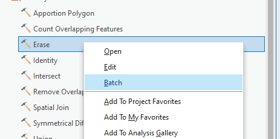{ .no-filter .off-glb }
{: align=center}

Pro ilustraci můžeme použít nástroj "Clip" pro oříznutí několika datových sad do zájmové oblasti. Postupujte následovně:

## Použité datové podklady

- [Pobočky](../assets/cviceni3/PobockyCP_PlzenskyKraj.zip) České pošty v Plzeňském kraji (bodová vrstva)
- Obce ČR ([ArcČR 500](../../data/#arccr-500), polygonová vrstva)

## Náplň cvičení

### 1. pošty

Představte si, že pracujete jako GIS analytik pro Českou poštu a vaším úkolem je z důvodu úspor navrhnout řešení snížení počtu poboček. Snahou tohoto kroku je však i minimalizace negativních dopadů na obyvatele, proto bylo rozhodnuto o následujících podmínkách, které musíte ve svém návrhu dodržet:

1. Rušení poboček nebude probíhat v obcích s méně než 2500 obyvateli.
2. V obcích nad 2500 obyvatel neklesne počet poboček pod 1.
3. Vzájemná vzdálenost poboček v jedné obci nebude nižší než 3 km vzdušnou čarou.

Jakou finanční úsporu jste schopni svým návrhem zajistit, pokud by provoz jedné pobočky vycházel ročně na 2,5 milionu CZK? Pro zjednodušení budete úlohu řešit pouze v rámci Plzeňského kraje a ke každé pobočce přistupovat rovnocenně.

Pracovní postup najdete ve cvičení 3 předmětu [**GIS1**](https://k155cvut.github.io/gis-1/cviceni/cviceni3/)

Shodný postup budeme aplikovat přímo v ModelBuilderu.

## Pracovní postup

**1.** Založení nového modelu.

Možnost vytvoření nového modelu nalezneme na záložce Analysis.

<figure markdown>
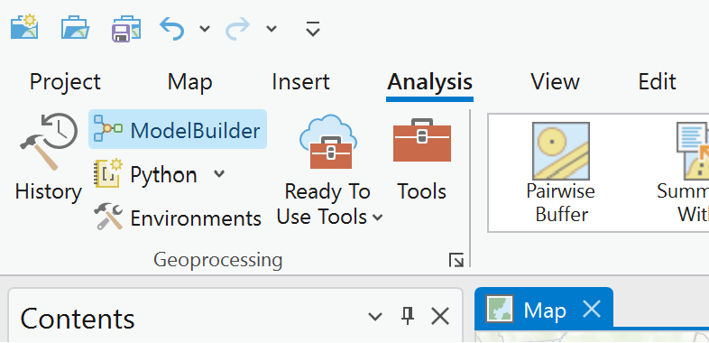{ width="500" }
    <figcaption>Založení modelu</figcaption>
</figure>

Nový model se nám tak přidá do toolboxu našeho projektu a otevře se v novém okně.

<figure markdown>
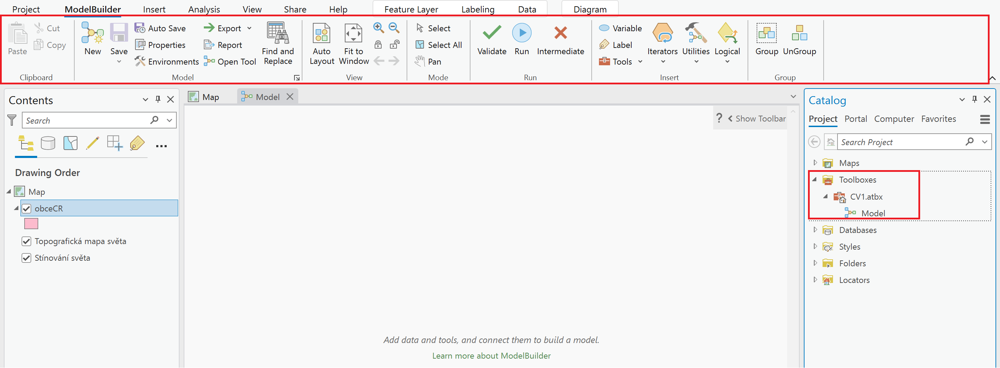{ width="700" }
    <figcaption>Nový model</figcaption>
</figure>

**2.** Přidání dat

Data přidáme jako položku do ModelBuideru přetažením vrstvy z panelu obsahu do plátna modelu.

<figure markdown>
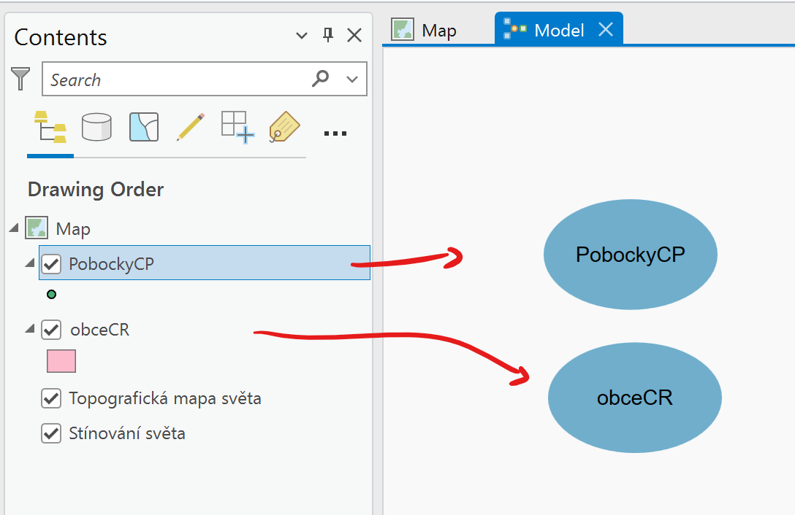{ width="500" }
    <figcaption>Přidání dat do modelu</figcaption>
</figure>

**3.** Výběr obcí v Plzeňském kraji s více než 2500 obyvateli (atributový dotaz) a tvorba samostatné vrstvy selektovaných prvků.

V sekci vložení na záožce ModelBuilderu můžeme z výběru nástrojů vyhledat požadovaný nástroj a buď pomocí dvojkliku nebo přetažením do modelu se nám v modelu graficky zobrazí. Jelikož však nástroj není napojený na stávající model, zobrazuje se šedou barvou.

<figure markdown>
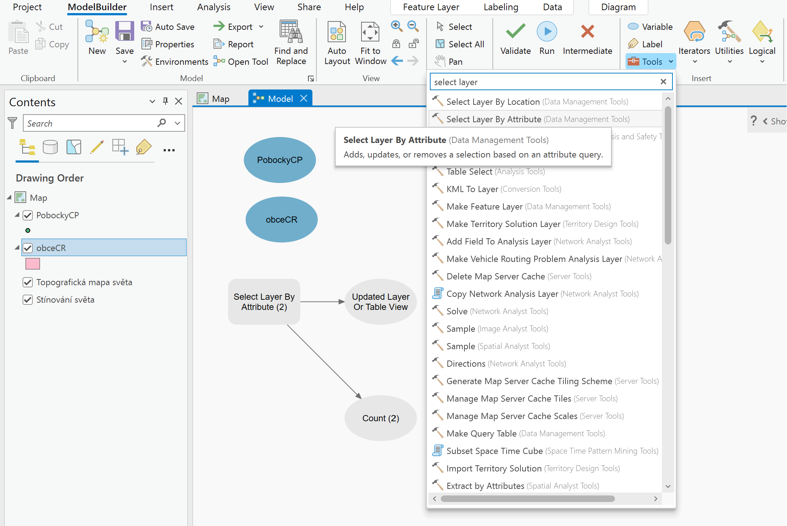{ width="500" }
    <figcaption>Výběr prvků atributovým výrazem</figcaption>
</figure>

Pro propojení vstupnách dat s funkcí musíme kliknout na položku dat, na která chceme výběr aplikovat, a přetáhnout kurzor myši na požadovanou funkci a zvolit význam vstupních dat v nástroji. Po propojení se graf vybarví, což znamená, že je aktivní.

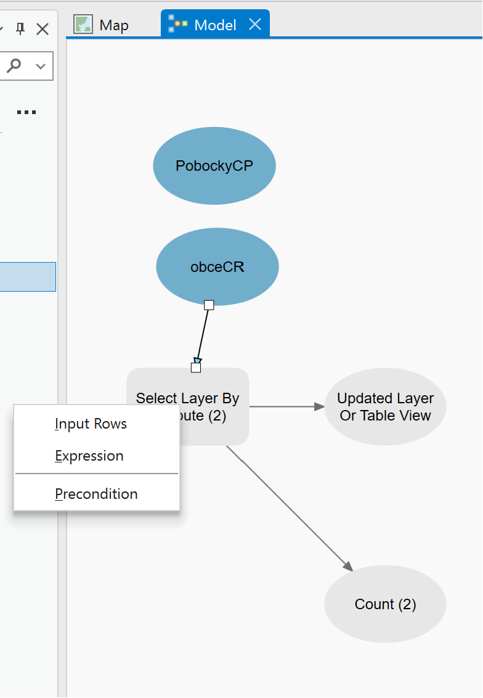
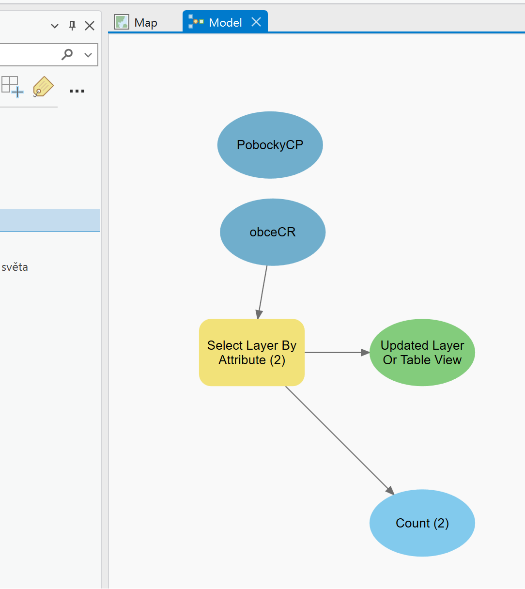
{: .process_container}

<figcaption>Provázání modelu</figcaption>

Po dvojkliku na nástroj (označený žlutou barvou) se zobrazí jeho konfigurace, tak jak ji známe. Můžeme zde tedy vyplnit podmínky.

<figure markdown>
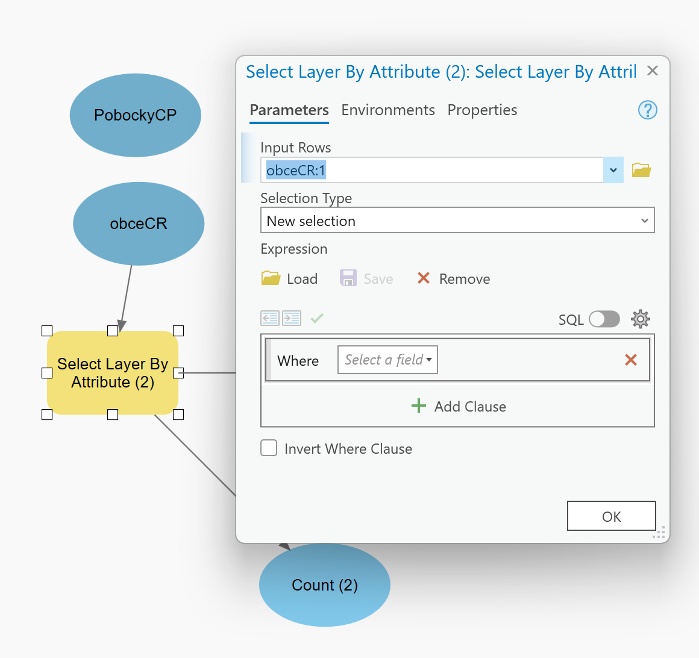{ width="400" }
    <figcaption>Konfigurační panel nástroje</figcaption>
</figure>

Klikneme-li na výsledek operace (zelený) pravým tlačátkem myši, můžeme zvolit, aby se po provedení zobrazil v mapě. Kliknutím pravým tlačítkem myši nad nástroj (žlutý) pak můžeme jednotlivé geoprocesingové nástroje spouštět.

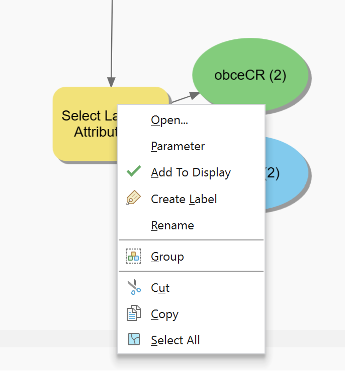
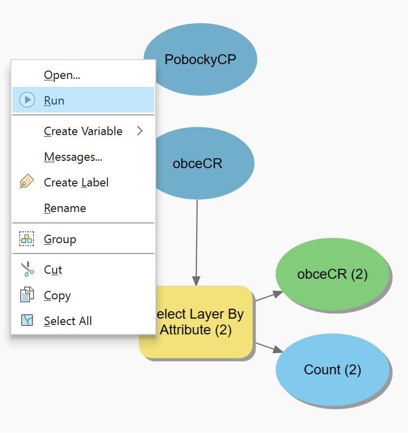
{: .process_container}

<figcaption>Spuštění nástroje a přidání výsledku do mapy</figcaption>

Postupně přidáme další geoprocessingové funkce odpovídající cvičení 3 z předmětu GIS1

<figure markdown>
{ width="700" }
    <figcaption>Celý model</figcaption>
</figure>

Nakonec můžeme ze vstupních proměnných vytvořit parametry, které bude uživatel moci konfigurovat.

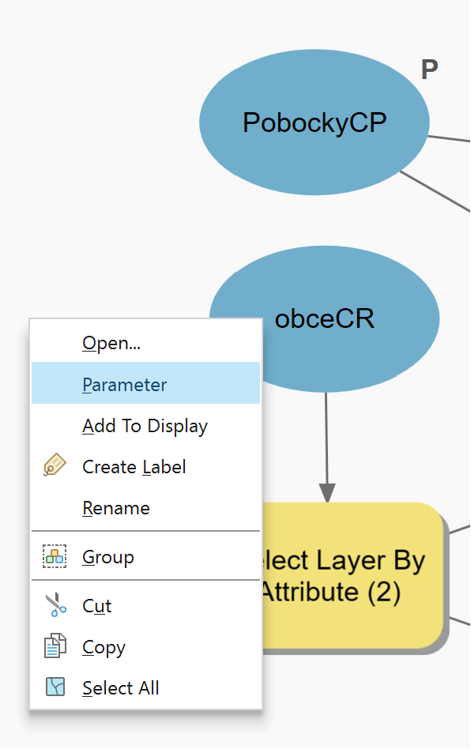
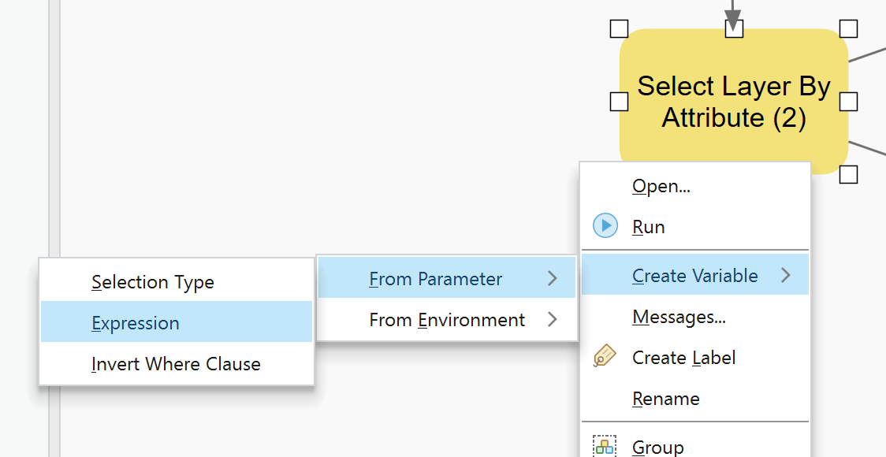
{: .process_container}

<figcaption>Zvolení parametrů</figcaption>
