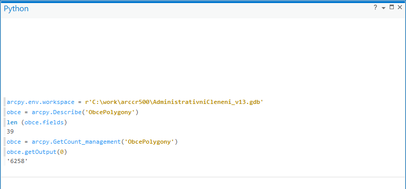
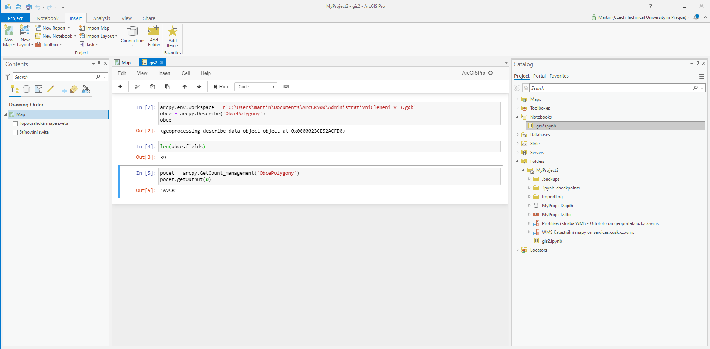

# ArcPy

## Cíl cvičení

Seznámení s Python balíčkem ArcPy.

## Základní pojmy

- **Python Window** (`View > Python Window`)
- **Jupyter Notebook** (`Insert > New Notebook`)

Užitečné odkazy:

* [Python in ArcGIS Pro](https://pro.arcgis.com/en/pro-app/arcpy/get-started/installing-python-for-arcgis-pro.htm)
* [A quick tour of creating tools with Python](https://pro.arcgis.com/en/pro-app/arcpy/geoprocessing_and_python/a-quick-tour-of-creating-tools-in-python.htm)
* [What is ArcPy?](https://pro.arcgis.com/en/pro-app/arcpy/get-started/what-is-arcpy-.htm)
* [ArcGIS API for Python](https://pro.arcgis.com/en/pro-app/arcpy/get-started/arcgis-api-for-python.htm)
* [Overview of the ArcGIS API for Python](https://developers.arcgis.com/python/guide/overview-of-the-arcgis-api-for-python/)
* [ArcPy API Reference](https://pro.arcgis.com/en/pro-app/arcpy/main/arcgis-pro-arcpy-reference.htm)
* [Use ArcPy in a notebook](https://doc.arcgis.com/en/arcgis-online/reference/use-arcpy-in-your-notebook.htm)
* [ArcGIS API for Python: ArcGIS in a Notebook](https://www.youtube.com/watch?v=FtuHFZUrrMc) (video)

## Použité datové podklady

- [ArcČR 500](../../data/#arccr-500)

## Náplň cvičení

### Úvod

Otevřte Python Window a vyzkoušejte úryvek kódu níže.

```py
arcpy.env.workspace = r"S:\K155\Public\data\ArcGIS\ArcCR500 3.3\AdministrativniCleneni_v13.gdb"
obce = arcpy.Describe("ObcePolygony")
len(obce.fields)
pocet = arcpy.GetCount_management("ObcePolygony")
pocet.getOutput(0)
```

Dokumentace:

- [Describe](https://pro.arcgis.com/en/pro-app/arcpy/data-access/describe.htm)
  - [FeatureClass properties](https://pro.arcgis.com/en/pro-app/arcpy/functions/featureclass-properties.htm)
  - [Table properties](https://pro.arcgis.com/en/pro-app/arcpy/functions/table-properties.htm)

<figure markdown>
{ width="500" }
    <figcaption>Python Window</figcaption>
</figure>

### Vypište typ geoprvků

```py hl_lines="3"
inputFC = r"S:\K155\Public\data\ArcGIS\ArcCR500 3.3\AdministrativniCleneni_v13.gdb\ObcePolygony"
shapeType = arcpy.Describe(inputFC).shapeType
print("Shape Type: {}".format(shapeType))
```

### Vypište názvy atributů

Následující úlohy již můžeme řešit v prostředí Jupyter Notebooku.

<figure markdown>
{ width="500" }
    <figcaption>Jupyter Notebook</figcaption>
</figure>

```py hl_lines="5"
arcpy.env.workspace = r"S:\K155\Public\data\ArcGIS\ArcCR500 3.3\AdministrativniCleneni_v13.gdb"
 
data = arcpy.Describe("ObcePolygony")   
for field in data.fields:
    print(field.name)
```

### Vypiště obce, které mají počet obyvatel vyšší než Liberec

```py hl_lines="10"
arcpy.env.workspace = r"S:\K155\Public\data\ArcGIS\ArcCR500 3.3\AdministrativniCleneni_v13.gdb"

rows = arcpy.SearchCursor("ObcePolygony", "NAZ_OBEC = 'Liberec'")   #vytvori cursor
for row in rows:
   pocet = row.POCET_OBYV # pocet obce Liberec
   break
rows = arcpy.SearchCursor("ObcePolygony")
for row in rows:
   if row.POCET_OBYV is not None and row.POCET_OBYV > pocet:
       print("{} - {}".format(row.NAZ_OBEC, row.POCET_OBYV))
```

### Vytvořte soubory ve formátu Esri Shapefile pro jednotlivé kraje

```py hl_lines="13"
import os
arcpy.env.overwriteOutput = True
arcpy.env.workspace = r"C:\Users\landamar\Documents\u04"
if not os.path.exists(arcpy.env.workspace):
    os.makedirs(arcpy.env.workspace)

kraje = r"S:\K155\Public\data\ArcGIS\ArcCR500 3.3\AdministrativniCleneni_v13.gdb\KrajePolygony"
rows = arcpy.SearchCursor(kraje)   #vytvori cursor
for row in rows:
    nazev = row.KOD_CZNUTS3
    print("{}...".format(nazev))
    kraje_Select_shp = r"{}\{}".formar(arcpy.env.workspace, nazev)
    arcpy.analysis.Select(kraje, kraje_Select_shp, "KOD_CZNUTS3 = '{}'".format(nazev))
```

### Vypište souřadnice lomových bodů uzemí obce 'Lhota'

```py hl_lines="10"
arcpy.env.workspace = r"S:\K155\Public\data\ArcGIS\ArcCR500 3.3\AdministrativniCleneni_v13.gdb"
 
obce = "ObcePolygony"

rows = arcpy.SearchCursor(obce, "NAZ_OBEC = 'Lhota'")
for row in rows:
    print("Prvek {}: ".format(row.NAZ_OBEC))
    for cast in prvek.SHAPE:
        for bod in cast:
            print("{} {}".format(bod.X, bod.Y))
```

## Další úlohy k procvičení

1. Pro jednotlivé kraje vytvořte třídy prvků ve formátu FileGDB
1. Zjistěte, jaká obec v ČR má nejdelší hranici.
1. Vytvořte funkci, která vrátí počet obcí s menším počet obyvatel než zadaná obec (jako parametr funkce).
