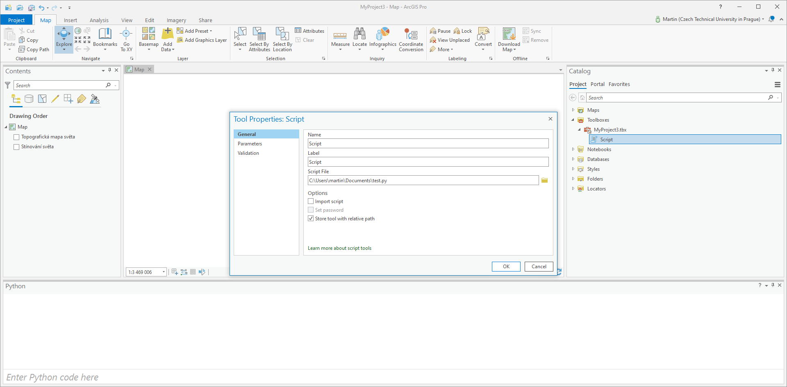
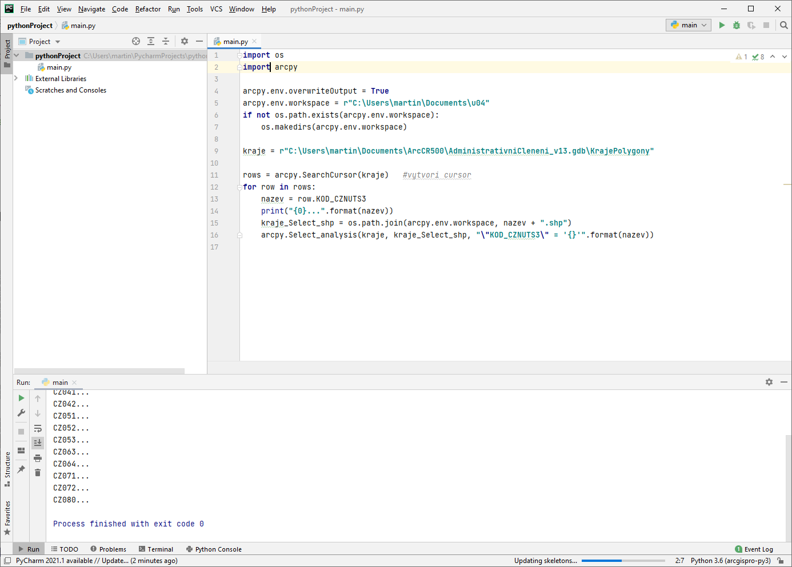
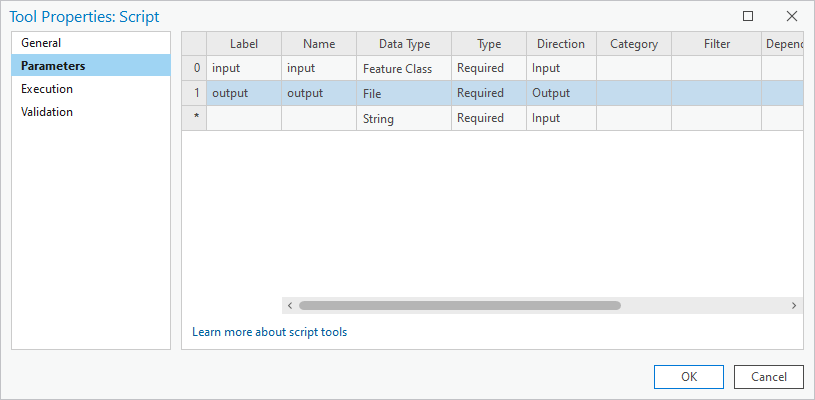

# Skriptování v ArcGIS Pro

## Cíl cvičení

Probloubení znalosti vytváření skriptů v jazyku Python pro platformu ArcGIS Pro.

## Základní pojmy

- **Registrace skriptu v ArcGIS Pro**

<figure markdown>
{ width="500" }
    <figcaption>Registrace skriptu v prostředí ArcGIS Pro</figcaption>
</figure>

- **IDE**

<figure markdown>
{ width="500" }
    <figcaption>Spuštění skriptu v prostředí Pycharm</figcaption>
</figure>

Ve vašem IDE zvolte cestu k Python interpretu odkazující na ArcGIS: ``C:\Program
Files\ArcGIS\Pro\bin\Python\envs\arcgispro-py3\python.exe``

## Použité datové podklady

- [ArcČR 500](../../data/#arccr-500)

## Náplň cvičení

### Práce s rastrovými daty pomocí Numpy

```py
dmt =  r"S:\K155\Public\data\ArcGIS\ArcCR500 3.3\ArcCR500_v33.gdb\DigitalniModelReliefu"

# otestovat nacteni dat
data = arcpy.Describe(dmt)
data.dataType

# nacteni metadat rastru
raster = arcpy.Raster(dmt)
raster.width, raster.height

# nacteni rastrovych hodnot do numpy pole
array = arcpy.RasterToNumPyArray(raster)
type(array)

# rozmer a datovy typ pole
array.shape, array.dtype

# zjisteni minimalni, maximalni hodnoty
array.min(), array.max()

# nastaveni no-data hodnoty
array = arcpy.RasterToNumPyArray(raster, nodata_to_value=-1)
array.min(), array.max()

# cetnost hodnot
unique, counts = numpy.unique(array, return_counts=True)
idx = numpy.where(unique == 200)
counts[idx]

# ukazka mapove algebry
array[(array>=0) & (array<=200)] = 0
array[(array>200)] = 1
numpy.unique(array, return_counts=True)

# zapis numpy pole do rastru
arcpy.env.outputCoordinateSystem = dmt
lowerLeft = arcpy.Point(data.extent.XMin, data.extent.YMin)
vystup = arcpy.NumPyArrayToRaster(array, lowerLeft,
                                  x_cell_size=data.meanCellWidth, y_cell_size=data.meanCellHeight,
                                  value_to_nodata=-1)
vystup.save(r"C:\users\martin\Documents\dmt200.tif")
```

Dokumentace:

- [NumPy](https://numpy.org/)
* [Working with NumPy in ArcGIS](https://pro.arcgis.com/en/pro-app/latest/arcpy/get-started/working-with-numpy-in-arcgis.htm)

### Ukázka vytvoření skriptu

Navážeme na znalosti ArcPy:

```py
import os
arcpy.env.workspace = os.environ["HOMEPATH"]

# vyber a export dalnic
silnice = r"S:\K155\Public\data\ArcGIS\ArcCR500 3.3\ArcCR500_v33.gdb\Silnice_2015"
dalnice = "dalnice.shp"
arcpy.analysis.Select(silnice, dalnice, "TRIDA = 1")

# buffer kolem dalnic
buffer_dal = "dalnice_buf.shp"
vzdalenost = "5000 meters"
arcpy.analysis.Buffer(dalnice, buffer_dal, vzdalenost, dissolve_option="ALL")

# odstraneni nepotrebnych vrstev
arcpy.management.Delete(dalnice)
```

Dokumentace:

* [Select](https://pro.arcgis.com/en/pro-app/latest/tool-reference/analysis/select.htm)
* [Buffer](https://pro.arcgis.com/en/pro-app/latest/tool-reference/analysis/buffer.htm)
* [Delete](https://pro.arcgis.com/en/pro-app/latest/tool-reference/data-management/delete.htm)

Úkoly:

1. Zprovozněte výpočet v Jupyter Notebooku
1. Přepište do formy skriptu a registrujte jej v prostředí ArcGISu
   (New -> Script) včetně nastavení vstupních parametrů (vstupní třída
   prvků silnice, cesta k výslednému souboru ve formátu Esri
   Shapefile).
   { width="500" }
1. Nastavte IDE (PyCharm nebo VS Code) tak, aby šel skript spustit i z něj.

### Modul ArcGIS

Dokumentace:

- [ArcGIS API for Python](https://developers.arcgis.com/python/guide/using-the-api/)
- [ArcGIS GIS module](https://developers.arcgis.com/python/api-reference/arcgis.gis.toc.html)
- [Documentation and samples for ArcGIS API for Python](https://github.com/Esri/arcgis-python-api)

<!--
!!! task-fg-color "Úkol"

    Vyzkoušejte balíček `arcgis` na JupyterHubu: <http://gislab.fsv.cvut.cz:8000>.
-->
#### Inicializujeme mapového okno

```py
import arcgis
gis = arcgis.GIS()

map1 = gis.map()
map1
```

#### Vykreslíme výchozí podkladové mapy v novém mapovém okně

```py
map2 = gis.map(location='Prague, Czech Republic', zoomlevel = 12)
map2
```

#### Vyhledáme online vrstvy podle klíčového slova

```py
from IPython.display import display

items = gis.content.search('Praha', item_type="Feature Layer", outside_org=True)
print(len(items))
for item in items[:3]:
    display(item)
```

#### Přídáme vybrané onlive vrstvy do mapového okna

```py
layer = items[0].layers[0]
map2.add_layer(layer)
map2.zoom_to_layer(layer)
```

#### Na závěr vyzkoušíme integraci s knihovnou Pandas:

```py
import pandas
okresy = pandas.DataFrame.spatial.from_featureclass(r"S:\K155\Public\data\ArcGIS\ArcCR500 3.3\AdministrativniCleneni_v13.gdb\OkresyPolygony")
okresy.spatial.plot(map_widget=map1)
map1
```

## Další úlohy k procvičení

Další ukázky skriptů [zde](https://geo.fsv.cvut.cz/vyuka/155gis2/cviceni/10/arcpy-ulohy/).
