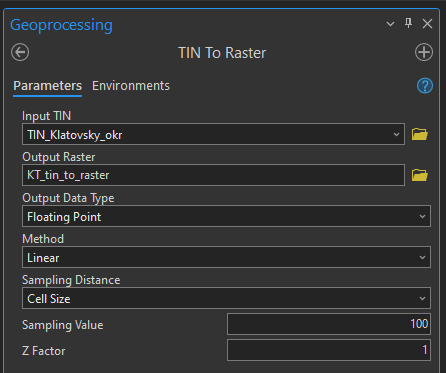
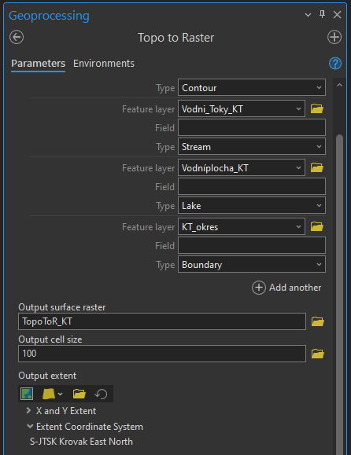

# Tvorba digitálního modelu terénu

## Cíl cvičení
Představení tvorby digitálního modelu terénu pomocí GIS.

## Základní pojmy
- **DMT (digitální model terénu)** – digitální reprezentace prostorových objektů (obecný pojem obsahující různé způsoby vyjádření terénního reiéfu nebo povrchu)
- **DMR (digitální model reliéfu)** – digitální reprezentace zemského povrchu (NEbsahuje vegetaci, lidské stavby)
- **DMP (digitální model povrchu)** – digitální reprezentace zemského povrchu (obsahuje vegetaci, lidské stavby, které jsou pevně spojené s reliéfem)
- [**TIN**](https://pro.arcgis.com/en/pro-app/3.1/help/data/tin/tin-in-arcgis-pro.htm) – trojúhelníková nepravidelná síť, která nejlépe reprezentuje povrch jako celek

???+ note "&nbsp;Digitální modely terénu České republiky"
     - **DMP 1G** – Digitální model povrchu České republiky 1. generace (DMP 1G) představuje zobrazení území včetně staveb a rostlinného pokryvu ve formě nepravidelné sítě výškových bodů (TIN) s úplnou střední chybou výšky **0,4 m** pro přesně vymezené objekty (budovy) a **0,7 m** pro objekty přesně neohraničené (lesy a další prvky rostlinného pokryvu). Model vznikl z dat pořízených metodou leteckého laserového skenování výškopisu území České republiky v letech 2009 až 2013. 
     - **DMR 4G** – Digitální model reliéfu České republiky 4. generace (DMR 4G) představuje zobrazení přirozeného nebo lidskou činností upraveného zemského povrchu v digitálním tvaru ve formě výšek diskrétních bodů v pravidelné síti (5 x 5 m) bodů o souřadnicích X,Y,H, kde H reprezentuje nadmořskou výšku ve výškovém referenčním systému Balt po vyrovnání (Bpv) s úplnou střední chybou výšky **0,3 m** v odkrytém terénu a **1 m** v zalesněném terénu. Model vznikl z dat pořízených metodou leteckého laserového skenování výškopisu území České republiky v letech 2009 až 2013.
     - **DMR 5G** – Digitální model reliéfu České republiky 5. generace (DMR 5G) představuje zobrazení přirozeného nebo lidskou činností upraveného zemského povrchu v digitálním tvaru ve formě výšek diskrétních bodů v nepravidelné trojúhelníkové síti (TIN) bodů o souřadnicích X,Y,H, kde H reprezentuje nadmořskou výšku ve výškovém referenčním systému Balt po vyrovnání (Bpv) s úplnou střední chybou výšky **0,18 m** v odkrytém terénu a **0,3 m** v zalesněném terénu. Model vznikl z dat pořízených metodou leteckého laserového skenování výškopisu území České republiky v letech 2009 až 2013. Dokončen byl k 30. 6. 2016 na celém území ČR. (Zdroj: ČÚZK)

## Aplikace Analýzy výškopisu 
Pro analýzu výškopisu ve webovém prostředí slouží mapová aplikace Analýzy výškopisu od Českého úřadu zeměměřického a katastrálního. Aplikace umožňuje provádějí základních výškových analýz nad daty DMP 1G, DMR 4G a DMR 5G. Pro každou datovou sadu nabízí několik rastrových funkcí (Stínovaný reliéf, Z-faktor apod.). Do rozhraní je možné přidat i vlastní data, a tedy zefektivnit používání aplikace v reálné praxi.

[https://ags.cuzk.cz/av/ Analýzy výškopisu ČÚZK](https://ags.cuzk.cz/av/){ .md-button .md-button--primary .button_larger .external_link_icon target="_blank"}
{: .button_array}

<figure markdown>
  { width="900"}
  <figcaption>Analýza pole viditelnosti ze zadaného bodu vypočteného nad DMR 5G</figcaption>
</figure>

## Vybrané zdroje výškopisných dat
- [ČÚZK Geoprohlížeč](https://ags.cuzk.cz/geoprohlizec/)
    * ZABAGED – [vrstevnice](https://ags.cuzk.cz/arcgis/rest/services/ZABAGED_VRSTEVNICE/MapServer), [DMP 1G](https://ags.cuzk.cz/arcgis2/rest/services/dmp1g/ImageServer), [DMR 4G](https://ags.cuzk.cz/arcgis2/rest/services/dmr4g/ImageServer),  [DMR 5G](https://ags.cuzk.cz/arcgis2/rest/services/dmr5g/ImageServer)
    * INSPIRE – [nadmořská výška (grid)](https://ags.cuzk.cz/arcgis2/rest/services/INSPIRE_Nadmorska_vyska/ImageServer), [nadmořská výška (TIN)](https://ags.cuzk.cz/arcgis2/rest/services/INSPIRE_Nadmorska_vyska_TIN/MapServer)
    * Geoportál Praha – [vrstevnice](https://geoportalpraha.cz/vyhledavani?topic=data&type=[opendata])

## Použité datové podklady
- Vrstevnice zdůrazněná, Vodní toky, Vodní plochy ([ZABAGED](../../data/#zabaged))
- Okres ([RÚIAN](../../data/#ruian))

## Náplň cvičení
Úkolem bude vytvořit TIN z vrstevnic a hydrologicky exaktní model terénu.

???+ note "&nbsp;Druhy reprezentace digitálního modelu terénu v GIS"
     - **vektor**
        * možnost pokročilejšího modelování vstupních dat
        * dobře vystihují tvar terénu, ale nereprezentují povrch jako celek
        * vhodné pro využití v kartografii

     - **TIN**
        * nejlépe reprezentuje povrch jako celek
        * složitý výpočet

     - **rastr**
        * poskytuje vlivem vzorkování horší celkovou reprezentaci povrchu
        * pro analýzy lze využít jednoduché algoritmy

## Postup

### Tvorba TIN
???+ note "&nbsp;Pozn."
     TIN vzniká na základě Delaunayho triangulace. Ta rozdělí vstupní body do tzv. Thiessenových polygonů (také Voroniovy diagramy), pro které platí, že z každého místa polygonu je vzdálenost k danému bodu uvnitř polygonu menší než k jakémukoliv jinému bodu ze zadané množiny. Další krok spočívá v propojení bodů v sousedících polygonech.

<figure markdown>
  { width="900"}
  <figcaption>Postup tvorby Delaunayho triangulace (vpravo) na základě Thiessenových polygonů (vlevo)</figcaption>
</figure>

**1.** Nejprve vybereme vhodný zdroj výškopisných dat, která pro výpočet použijeme. V tomto případě se bude jednat o vrstevnice ze ZABAGED, konkrétně využijeme vrstvu *Vrstevnice zdůrazněná*.

**2.** Většinou není potřeba vytvářet DMT pro celou republiku, což je výpočetně a časově náročné. Pro začátek je tedy vhodné vrstvu vrstevnic oříznout vybraným polygonem pomocí funkce [*Clip*](https://pro.arcgis.com/en/pro-app/latest/tool-reference/analysis/clip.htm).

**3.** Dále je nutné vytvořit TIN pomocí funkce [*Create TIN*](https://pro.arcgis.com/en/pro-app/latest/tool-reference/3d-analyst/create-tin.htm). Ve funkci určíme zázev a místo uložení výsledného TINu včetně jeho součadnicového systému (dle mapy). Následně vyplníme zdrojovou vrstvu výškových dat *Input Features*, tedy vrstevnice oříznuté dle určeného polygonu (v tomto případě zvýrazněné vrstevnice v Klatovském okresu). 

**4.** Podle zvolených dat je potřeba nastavit další parametry funkce. Atribut výšky *Height Field* se nastaví automaticky, je potřeba jej ale zkontrolovat. *Type* určuje typ vstupní vrstvy. Jestliže jsou vstupní vrstvou výškové kóty, zvolíme *Mass_Points*. V případě vrstevnic se vybere buď *Hard_Line* či *Soft_Line*.

???+ note "&nbsp;Pozn."
     Při vytváření TIN lze kombinovat několik vrstev, tudíž je možné na příklad použít vrstevnice, které budou zpřesněny bodovou vrstvnou výškových kót.

<figure markdown>
  
  <figcaption>Tvorba TIN z vrstevnic</figcaption>
</figure>

**5.** Podle rozsahu a detailu vstupních dat může výpočet trvat i několik minut. Výsledkem je terén ve formě TINu a případně vrstva vstupních vrstevnic, kterou lze skrýt.

<figure markdown>
  {width="400"}
  <figcaption>Vypočtený TIN pro Klatovský okres</figcaption>
</figure>

**6.** Pokud je potřeba, můžeme TIN následně upravovat/zpřesňovat dalšími výpočty ve funkci [*Edit TIN*](https://pro.arcgis.com/en/pro-app/latest/tool-reference/3d-analyst/edit-tin.htm).

### Převod TIN to Raster
**1.** Jestliže máme vytvořený TIN, můžeme pokračovat jeho převedením na rastr pomocí funkce [*TIN to Raster*](https://pro.arcgis.com/en/pro-app/latest/tool-reference/3d-analyst/tin-to-raster.htm) (lze převést také rastr do TINu inverzní funkcí).

**2.** Ve funkci je potřeba opět určit parametry výpočtu. *Output Data Type* určuje datový typ rastru, tedy zda mohou mít jeho pixely hodnoty desetinných čísel *Floating Point* nebo se hodnoty zaokrouhlí na celá čísla *Integer*. Dále je potřeba určit metodu interpolace dat *Linear* nebo *Natural Neighbors*. Poslední parametr definuje velikost pixelu výstupního rastru.

<figure markdown>
  
  <figcaption>Hodnoty funkce TIN to Raster</figcaption>
</figure>

**3.** Parametr *Cell size* definující velikost pixelu rastru, je potřeba navolit na základě přesnosti vstupních dat a požadované přesnosti právě výstupního rastru. Vyšší přesnost bude znamenat větší velikost rastru na disku.

**4.** Takto vypočtený TIN a rastr obsahují také hodnoty mimo zájmové území (ořezový polygon). Tyto hodnoty byly dopočteny na základě triangulace a v ideálním případě je vhodné je smazat. To se provede funkcí [*Extract by Mask*](https://pro.arcgis.com/en/pro-app/latest/tool-reference/spatial-analyst/extract-by-mask.htm). Jako ořezovou masku nastavíme v tomto případě opět vrstvu Klatovského okresu. 

???+ note "&nbsp;Pozn."
     Ořez je možné provést již pro TIN použitím funkce *Edit TIN*.

<figure markdown>
  {width="400"}
  <figcaption>Výsledný digitální model terénu Klatovského okresu s velikostí pixelu 100 m</figcaption>
</figure>

### Tvorba hydrologicky korektního rastrového modelu terénu
???+ note "&nbsp;Pozn."
     Pro některé úlohy potřebujeme hydrologicky korektní model terénu, ve kterém budou respektovány spádnice a voda tedy teoreticky "nepoteče do kopce". Pro takové analýzy není vhodný klasický DMT, protože kvůli výpočetnímu procesu nesplňuje podmínky hydrologické korektnosti.

     Téma využití GIS pro hydrologické analýzy je jednou z náplní volitelného předmětu [GIS v krajinném inženýrství](https://storm.fsv.cvut.cz/pro-studenty/predmety/magisterske-studijni-programy/geodezie-a-kartografie-mgr/gis-v-krajinnem-inzenyrstvi/?lang=cz).

**1.** Hydrologicky korektní model se vypočte funkcí [*Topo To Raster*](https://pro.arcgis.com/en/pro-app/latest/tool-reference/3d-analyst/topo-to-raster.htm), kterou najdeme v rozšíření *3D Analyst*.

**2.** Do této funkce je možné přidat více vstupních dat než v případě *Create TIN*. Veškerá vstupní data je potřeba oříznout dle okresu, jinak by byla počítána nadbytečná data, což by mohlo výrazně zvýšit čas výpočtu. Základní vrstvou bude opět *Vrstevnice zdůrazněná* s typem *Contour*. 

**3.** Dále přidáme tři pomocné vrstvy (ty nemusejí být nutnou součástí funkce, slouží ke zpřesnění výsledku). První z nich budou tvořit vodní toky ze ZABAGED. Pro výpočet je zásadní, aby byla vrstva vodních toků správně orientovaná, tedy po proudu. Vizuální kontrolu lze provést změnou symbologie vrstvy, přičemž nahradíme obyčejnou linii za linii se šipkou na konci. Důležité je pro výpočet vyfiltrovat pouze nadzemní toky. Nastavíme typ *Stream*.

<figure markdown>
  {width="900"}
  <figcaption>Ukázka správného směru vodních toků</figcaption>
</figure>

**4.** Druhou pomocnou vrstvu budou tvořit vodní plochy opět ze ZABAGED. Té přiřadíme typ *Lake*. Jako třetí přidáme polygon okresu, čímž docílíme oříznutí výstupního rastru. Pro okres nastavíme typ *Boundary*.

**5.** Opět je potřeba nastavit velikost buňky, tedy *Output cell size*, která se zvolí obdobně jako v předchozích případech.

**6.** Další parametry funkce ponecháme ve výchozím nastavení. Jedná se o pokročilé parametry, jejichž úprava souvisí s následným dalším využitím rastru. Pokud bychom je v budoucnu potřebovali, získáme více informací v dokumentaci.

<figure markdown>
  
  <figcaption>Hodnoty funkce Topo To Raster</figcaption>
</figure>

???+ note "&nbsp;Úprava symbologie rastru"
     Po vybrání rastrové vrstvy můžeme v horní liště *Raster Layer* měnit její symbologii, viditelnost či způsob převzorkování (*Resampling Type*). Díky úpravě těchto parametrů lze z rastrových digitálních modelů terénu vyčíst informace, které nejsou na první pohled zřejmé. Například změna *Resapling Type* z *Nearest Neighbor* na *Bilinear* naprosto vizuálně odstraní pixelování rastru. 

     V horní liště *Data* je možné pro některé rastry vybrat předpřipravené *Processing Templates*, díky čemuž lze změnit hodnoty rastru. Ku příkladu při importu služby DMR 5G ze ZABAGED se zobrazují hodnoty rastru od 0 do 255. Pro zjištění přesných výšek je potřeba nastavit *Processing Template* na *None*.

     Díky těmto úpravám můžeme DMT používat jako podkladovou vrstvu pro řadu vizualizací.

<figure markdown>
  
  <figcaption>Ukázky různých možností symbologie totožného rastru</figcaption>
</figure>

## Zdroje
Úvod do GIS: Zpracování dat II [online]. In: JEDLIČKA, Karel. [cit. 2024-01-05]. Dostupné z: [https://gis.zcu.cz/studium/ugi/Prezentace/09-InterpolaceTvorbaDMRTopologickeCisteniDatGeneralizace.pdf](https://gis.zcu.cz/studium/ugi/Prezentace/09-InterpolaceTvorbaDMRTopologickeCisteniDatGeneralizace.pdf)

Český úřad zeměměřický a katastrální [online]. [cit. 2024-01-05]. Dostupné z: [https://www.cuzk.cz/](https://www.cuzk.cz/)

Delaunayho triangulace [online]. ZÁPADOČESKÁ UNIVERZITA V PLZNI. [cit. 2024-01-05]. Dostupné z: [http://old.gis.zcu.cz/studium/ugi/cviceni/ch08s01.html](http://old.gis.zcu.cz/studium/ugi/cviceni/ch08s01.html)