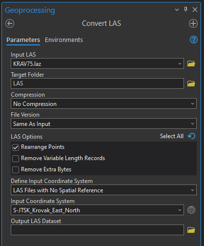
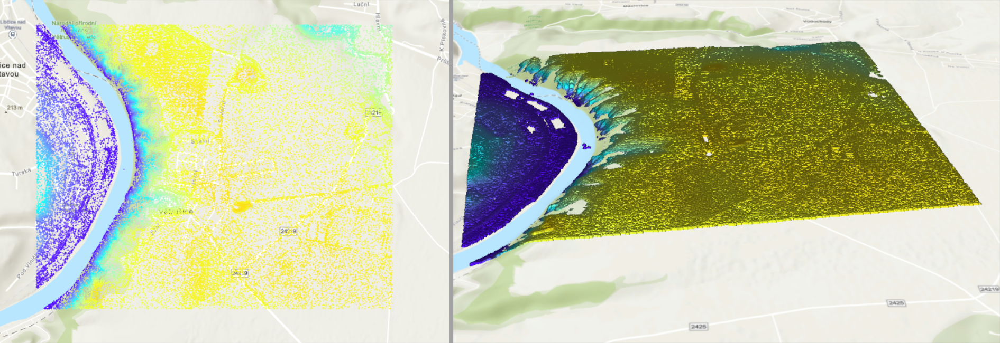
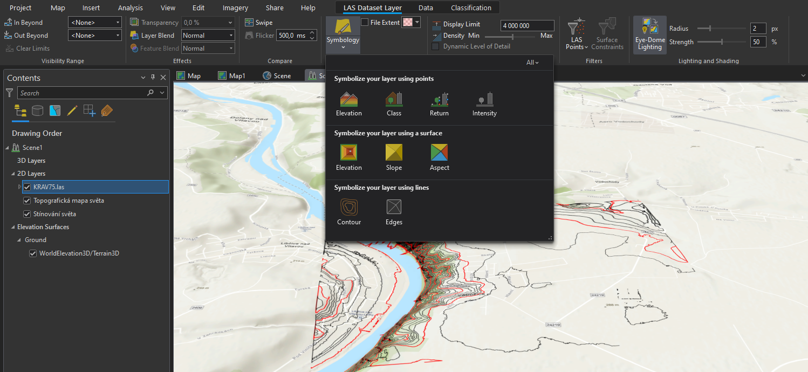
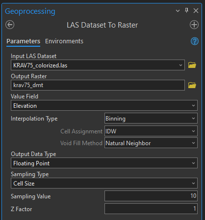
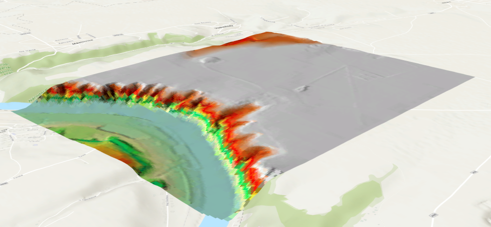

# Zpracování LAS

## Cíl cvičení
Zpracování LiDARových dat v prostředí ArcGIS Pro včetně představení možností jejich symbologie a následného využití v GIS analýzách.

## Základní pojmy
- **[LiDAR](https://www.geosken.cz/co-je-lidar-a-jak-funguje/)** – metoda dálkového měření vzdálenosti na základě výpočtu doby šíření pulsu laserového paprsku odraženého od snímaného objektu

- **[LAS](https://pro.arcgis.com/en/pro-app/3.1/help/data/las-dataset/las-dataset-in-arcgis-pro.htm)** – datový formát mračna bodů (point cloud) získaných laserovým skenováním

## Použité datové podklady
- [DMR 5G](../../data/#dmr-5g)

- [ortofoto ČÚZK](https://ags.cuzk.cz/arcgis1/rest/services/ORTOFOTO/MapServer)

## Náplň cvičení

### Stažení dat z ČÚZK
Z [Geoprohlížeče ČÚZK](https://ags.cuzk.cz/geoprohlizec/) lze stáhnout data laserového skenování (mračno bodů) pro Česko. Získání dat DMR 5G, DMR 4G či DMP 1G lze provést přes výběr daného podkladu v záložce *Produkty*. Dále po rozkliknutí ikony tří teček příslušné vrstvy v záložce *Seznam vrstev* je možné vybrat buď možnost   *Exportovat data* nebo *Stáhnout data (předpřipravené jednotky)*.

???+ note "&nbsp;Možnosti stažení laserových dat z ČÚZK"
     - **Exportovat data** – Touto možností lze data zaslat přímo na email. Zároveň je takto možné stáhnout více kladů dat najednou vlastním výběrem (nakreslením polygonu či nahráním vlastní vrstvy k výběru). Stažená data jsou ve formátu *LAS*.

     - **Stáhnout data (předpřipravené jednotky)** – Takto lze data stáhnout postupně dle předpřipravených kladů. Stažená data jsou ve formátu *LAZ*.

### Převod LAZ do LAS
**1.** Jestliže získáme data ve formátu *ZLAS* nebo *LAZ*, je nutné mračno bodů v ArcGIS Pro konvertovat do formátu *LAS* pomocí funkce [*Convert LAS*](https://pro.arcgis.com/en/pro-app/latest/tool-reference/conversion/convert-las.htm). Takto převedná data již dokáže ArcGIS načíst.

**2.** Do parametru *Input LAS* vložíme z disku vstupní soubor, který chceme převést. Zvolíme adresář výstupních dat *Target Folder* a případně nastavíme parametry převodu.

**3.** Ve druhé části funkce určíme souřadnicový systém mračna bodů. 

<figure markdown>
  
  <figcaption>Hodnoty funkce Convert LAS</figcaption>
</figure>

### Vizualizace LAS
**1.** LAS data je možné zobrazit 2D v mapě nebo 3D ve scéně (ideálně v lokální scéně). Novou scénu vytvoříme v záložce *Insert* – *New Map* – *New Local Scene*.

<figure markdown>
  { width="900"}
  <figcaption>Porovnání zobrazení LAS dat ve 2D mapě (vlevo) a ve 3D scéně (vpravo)</figcaption>
</figure>

**2.** Různé možnosti vizualizace LAS jsou dostupné po vybrání vrstvy mračna bodů v záložce *LAS Dataset Layer*. Pod ikonou *Symbology* 

<figure markdown>
  { width="900"}
  <figcaption>Symbologie LAS</figcaption>
</figure>

**3.** Výše zmíněné možnosti symbologie se dělí na tři typy: Vizualizace dle bodů, terénem či liniově. Bodové vizualizace nabízejí zobrazení barvy mračna bodů na základě jeho nadmořské výšky (*Elevation*) nebo klasifikace dat (*Class*). Mračno bodů je dále možné symbolizovat jako terén, přičemž barva může být určená nadmořskou výškou (*Elevation*), sklonem terénu (*Slope*) nebo sklonem ke světové straně (*Aspect*). Třetí možnost, vizualizace vrstvy pomocí linií, nabízí zobrazení vrstevnic (*Contour*) a hran (*Edges*).

???+ note "&nbsp;Zobrazení LAS Dataset Layer"
     V záložce *LAS Dataset Layer* (po vybrání příslušného mračna bodů v *Contents*) lze nejen nastavovat možnosti symbologie, ale také je možné určit hustotu zobrazovaných bodů (sekce *Point Thinning*) nebo filtrovat body (sekce *Filters*).

### Texturovaný LAS
**1.** V některých případech je výhodné mračno bodů obarvit (pokud již texturu neobsahuje v základním nastavení). Stažený LAS z ČÚZK lze otexturovat pomocí ortofota, které se stáhne podobně jako laserová data z [Geoprohlížeče ČÚZK](https://ags.cuzk.cz/geoprohlizec/). Důležité je stáhnout data se stejným kladem, což pro zmíněná data platí.

**2.** Po stažení ortofota vyhledáme v *Geoprocessingu* funkci [*Colorize LAS*](https://pro.arcgis.com/en/pro-app/latest/tool-reference/3d-analyst/colorize-las.htm). Jako *Input Dataset* určímě mračno bodů. Do parametru *Input Image* vložíme vybrané ortofoto a zkontrolujeme přiřazení pásem snímku.

**3.** Dále zvolíme výstupní adresář *Target Folder* a případně specifikujeme název výsledného mračna bodů či jeho kompresi.

<figure markdown>
  
  <figcaption>Hodnoty funkce Colorize LAS</figcaption>
</figure>

**4.** Po provedení tohoto výpočtu se v nabídce *Symbology*, kterou jsme využívali při vizualizaci, zobrazí další možnost vizualizace mračna bodů – *RGB*. Po jejím zvolení se body obarví dle vstupního ortofota.

<figure markdown>
  { width="900"}
  <figcaption>Texturovaný LAS</figcaption>
</figure>

### Vytvoření digitálního modelu terénu
**1.** Data LiDARového skenování slouží jako podklad pro vytvoření digitálního modelu terénu. V ArcGISu Pro je možné převést LAS do rastru pomocí funkce [*LAS Dataset To Raster*](https://pro.arcgis.com/en/pro-app/latest/tool-reference/conversion/las-dataset-to-raster.htm).

**2.** Vstupními daty *Input LAS Dataset* jsou lasetová data ve formátu LAS. *Value Field* určuje hodnotu, na základě které se vypočte výstupní rastr. Jeho umístění určímě v parametru *Output Raster*. 

**3.** Následně je nutné určit způsob interpolace (viz [cvičení 5](https://k155cvut.github.io/gis-2/cviceni/cviceni5/)). Důležitým parametrem je *Cell Size*, která určuje velikost pixelu (buňky) výstupního rastru. *Z factor* určuje hodnotu zploštění/zvýšení hodnot rastru. V základním nastavení jej ponecháme rovný 1.

<figure markdown>
  
  <figcaption>Hodnoty funkce LAS Dataset To Raster</figcaption>
</figure>

<figure markdown>
  { width="900"}
  <figcaption>Digitální model terénu vypočtený na základě laserových dat</figcaption>
</figure>
