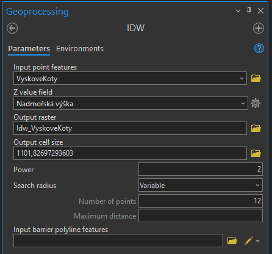
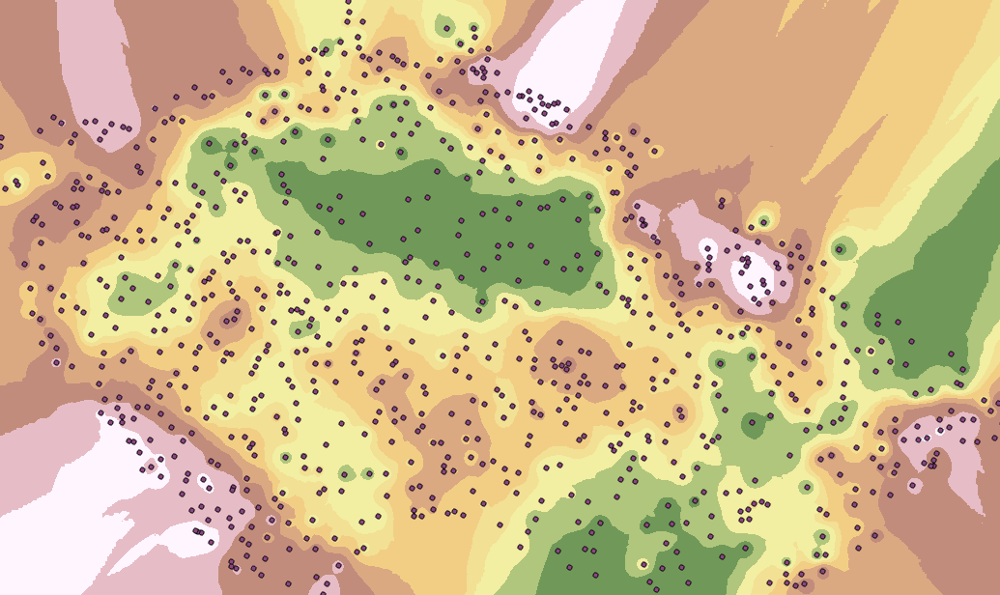
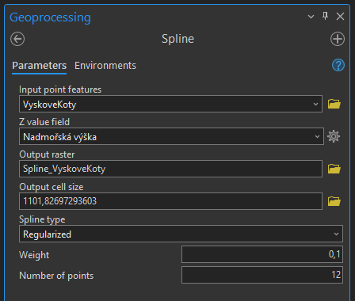
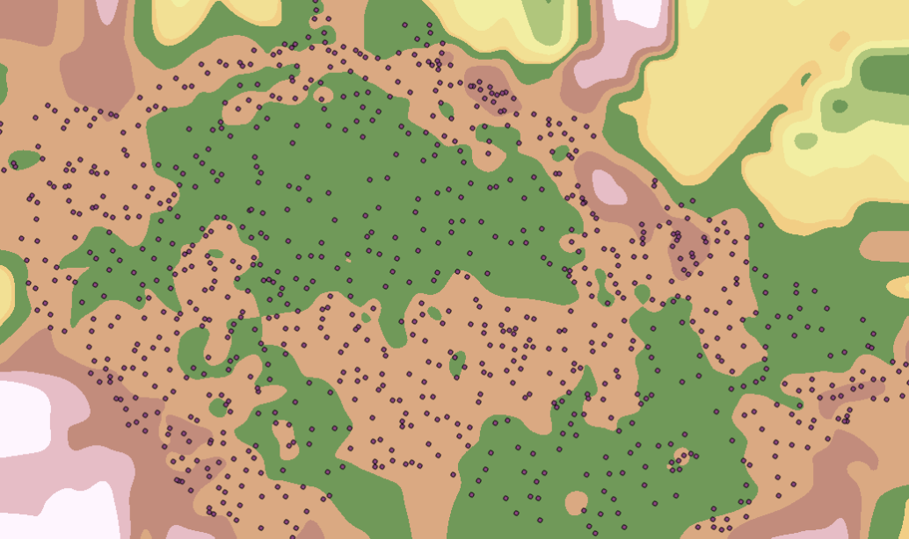
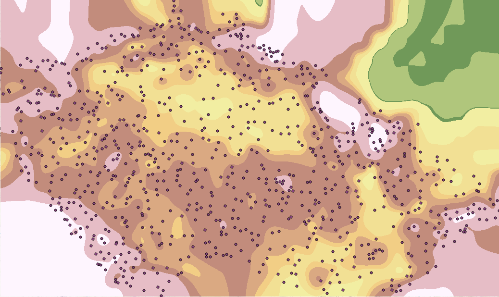
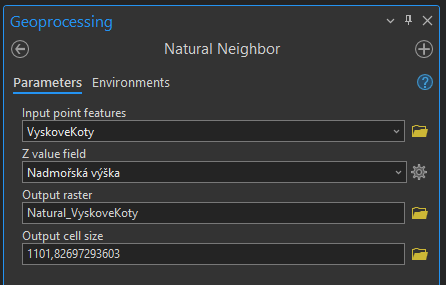
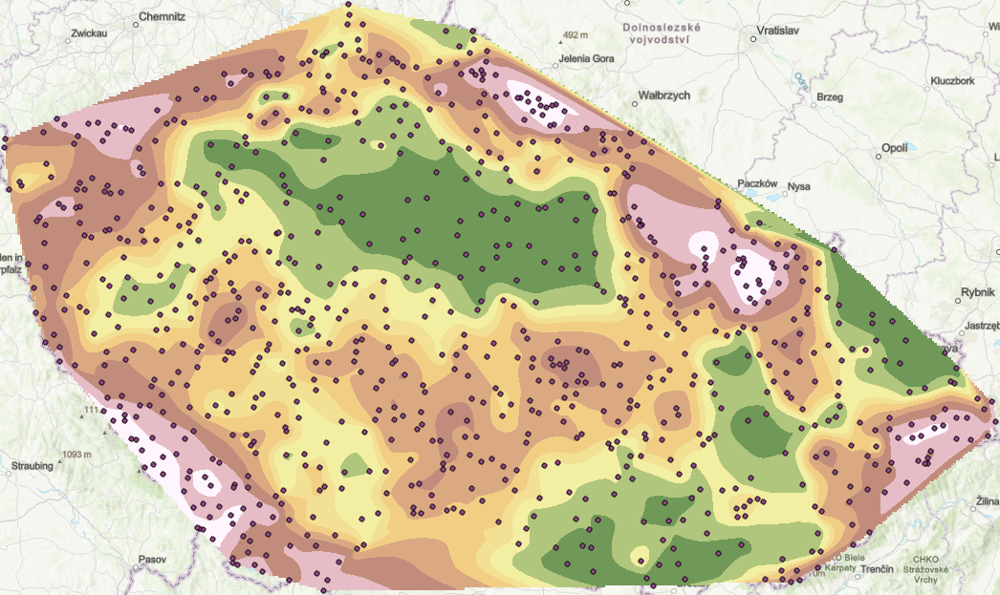
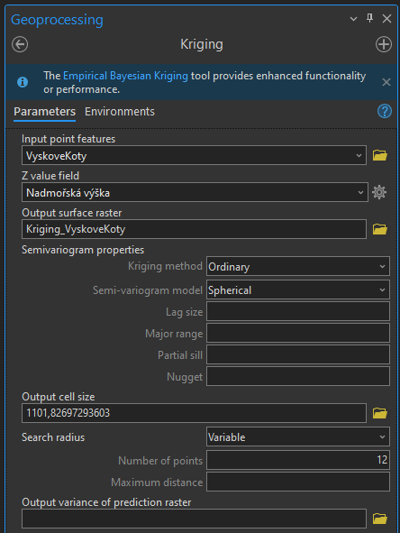
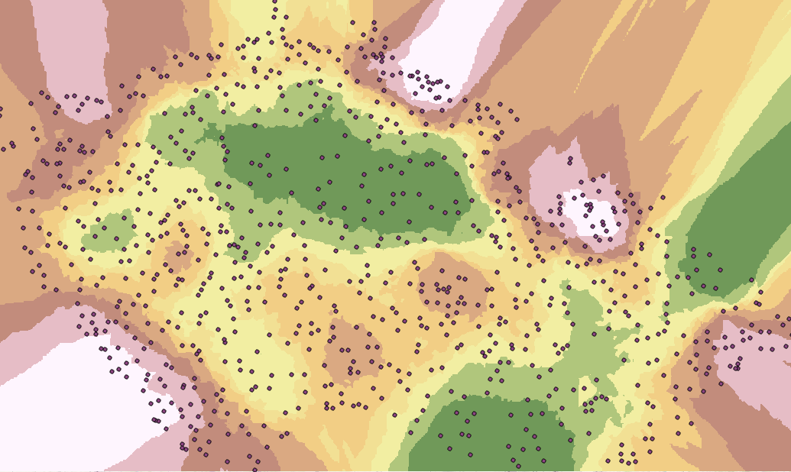

# Interpolace rastrových dat

## Cíl cvičení
Představení typů interpolace rastrových dat.

## Základní pojmy
- **Interpolace** – Nalezení neznámé hodnoty určitého jevu na základě známých okolních hodnot.
- **Extrapolace** – Funguje obdobným způsobem jako interpolace, ale dopočítává nové hodnoty za hranicemi vstupních známých hodnot.
- **Lineární interpolace** – Metoda interpolace počítající rovinu ze tří známých bodů. Jednotlivé středy buňěk se počítají z rovnic
rovin polohově překrývajících trojúhelníků. Používá se pro interpolaci vrstevnic na základě známých bodů.
- [**IDW**](https://pro.arcgis.com/en/pro-app/latest/tool-reference/3d-analyst/idw.htm)
- [**Spline**](https://pro.arcgis.com/en/pro-app/latest/tool-reference/3d-analyst/spline.htm)
- [**Natural Neighbor**](https://pro.arcgis.com/en/pro-app/latest/tool-reference/3d-analyst/natural-neighbor.htm)
- [**Trend**](https://pro.arcgis.com/en/pro-app/latest/tool-reference/3d-analyst/trend.htm)
- [**Kriging**](https://pro.arcgis.com/en/pro-app/latest/tool-reference/3d-analyst/kriging.htm)

???+ note "&nbsp;Pozn."
     **Interpolace** nemusí procházet zadanými body.

     **Aporoximace** musí procházet zadanými body.

## Použité datové podklady
- VyskoveKoty ([ArcČR 500](../../data/#arccr-500))

## Náplň cvičení
Pomocí interpolačních algoritmů nad zadanými daty vytvořte digitální model terénu. Jednotlivé algority vzájemně porovnejte a následně posuďte výhody a nevýhody každého z nich. Výstupy algoritmů je možné oříznout např. polygonem ČR funkcí *Extract by Mask*

## Postup
Do mapového okna načteme zadaná data a prohlédneme si jejich strukturu v atributové tabulce. Následně vypočteme jednotlivé interpolace.

### IDW
???+ note "&nbsp;IDW (Inverse Distance Weighted)"
     Metoda IDW (Inverse Distance Weighted) je založena na vážené inverzní vzdálenosti bodů. Hodnoty v buňkách se vypočítají na základě vzdálenosti okolních bodů. Čím dále je konkrétní bod od určované buňky, tím menší má vliv na výpočet její hodnoty.

     Nedochází k extrapolaci, tzn. nejsou vypočteny hodnoty vyšší nebo nižší než hodnoty vstupní.

     Výsledný povrch neprochází vstupními hodnotami. Dochází ke sploštění výsledku.

     Nejlepších výsledků je dosaženo při dostatečné hustotě vstupních bodů.

     Více o metodě [**ZDE**](https://pro.arcgis.com/en/pro-app/latest/tool-reference/3d-analyst/how-idw-works.htm). 

**1.** V záložce *Geoprocessing* vyhledáme variantu funkce *IDW*, která je obsažena v balíčku *3D Analyst*. 

**2.** Do *Input Point Features* vložíme vstupní bodovu vrstvu. *Z value field* jsou hodnoty, ze kterých budeme chtít rastr vypočítat – v našem případě tedy sloupec *Nadmořská výška*. Dále vyplníme název a umístění výstupní rastru do kolonky *Output raster*. 

**3.** Ve druhé části funkce lze nastavit parametry vstupující do výpočtu interpolace. Důležitá je volba *Output cell size*, která určije velikost pixelu výsledného rastru (jednotky jsou určeny na základě zvoleného kartografického zobrazení mapy), a tedy jeho přesnost. Při prvním spuštění lze ponechat východí hodnotu, kterou je případně dále možné modifikovat, pokud by bylo potřeba. Hodnota *Power* určuje váhu okolních bodů vstupujících do výpočtu na základě vzájemné vzdálenosti.

<figure markdown>
  
  <figcaption>Hodnoty funkce IDW</figcaption>
</figure>

<figure markdown>
  { width="900"}
  <figcaption>Výstup funkce IDW</figcaption>
</figure>

### Spline
???+ note "&nbsp;Spline"
     Metoda Spline (metoda minimální křivosti) spojuje dvojice zadaných bodů segmenty kubické křivky. 
     
     Generuje povrch s minimální křivostí, který prchází zadanými body. Počítány jsou pouze neznámé hodnoty.

     Není vhodná v případě, že vstupní body jsou blízko u sebe a sousedící body mají velmi rozdílné hodnoty. Metodu tedy nelze použít na dramaticky probíhající povrchy.

     Více o metodě [**ZDE**](https://pro.arcgis.com/en/pro-app/latest/tool-reference/3d-analyst/how-spline-works.htm). 

**1.** Opět zvolíme funkci z balíčku *3D Analyst*. Vstupní bodovou vrstvu vložíme do *Input point features*, *Z value field* přiřadíme sloupec *Nadmořská výška*, pojmenujeme výstupní vrstvu a zvolíme *Output cell size* (obdobně jako v předchozím případě).

**2.** Nastavení algoritmu tentokrát spočívá v typu křivky (*Spline type*) a počtu bodů, které vstupují do výpočtu (*Number of points*). 

- Regularized (výchozí) tvoří elastičtější povrch.
 
- Tension tvoří plošší povrch.

<figure markdown>
  
  <figcaption>Hodnoty funkce Spline</figcaption>
</figure>

<figure markdown>
  { width="900"}
  <figcaption>Výstup funkce Spline s nastavením Regularized</figcaption>
</figure>

<figure markdown>
  { width="900"}
  <figcaption>Výstup funkce Spline s nastavením Tension</figcaption>
</figure>

### Natural Neighbor
???+ note "&nbsp;Natural Neighbor"
     Metoda Natural Neighbor (přirozený soused) je založena na vybudování Thiessenových polygonů z bodové vrstvy tak, že do každého polygonu spadá jen jeden bod a z každého bodu polygonu je právě k tomuto bodu blíže než k bodům jiných polygonů.

     Více o metodě [**ZDE**](https://pro.arcgis.com/en/pro-app/latest/tool-reference/3d-analyst/how-natural-neighbor-works.htm). 

**1.** Funkce Natural Neighbor má velmi omezené nastavení parametrů. Vedle těch již známých nenabízí žádnou další modifikaci. Rozdíl tedy spočívá v nastavení velikosti pixelu výstupního rastru *Output cell size*.

<figure markdown>
  
  <figcaption>Hodnoty funkce Natural Neighbor</figcaption>
</figure>

<figure markdown>
  { width="900"}
  <figcaption>Výstup funkce Natural Neighbor</figcaption>
</figure>

### Trend
???+ note "&nbsp;Trend"
     Metoda trendu využívá polynomické regrese k proložení metody nejmenších čtverců celým povrchem.

     Vyhledává trendy, čímž vytváří hladší povrch než IDW.

     Využití pro hladké povrchy. Pro běžné analýzy se nevyužívá.

     Více o metodě [**ZDE**](https://pro.arcgis.com/en/pro-app/latest/tool-reference/3d-analyst/how-trend-works.htm). 

### Kriging
???+ note "&nbsp;Kriging"
     Kriging interpoluje hodnoty na základě apriorních kovariancí. Podobnost s metodou IDW, avšak váhy závisí kromě vzdálenosti i na prostorovém uspořádání vstupních bodů (výpočet pomocí prostorové závislosti – autokorelace).

     Více o metodě [**ZDE**](https://pro.arcgis.com/en/pro-app/latest/tool-reference/3d-analyst/how-kriging-works.htm). 

**1.** První část parametrů funkce *Kriging* v nadstavbě *3D Analyst* vyplníme opět obdobně jako v předchozích případech.

**2.** Druhá část parametrů nabízí konkrétní upřesnění výpočtu Krigingu. Zvolit lze dvě metody – *Ordinary* a *Universal*, přičemž dále je možné volit i model semivariogramu. Pro většinu dat je nejvhodnější *Ordinary Kriging*, který zachovává sumu vah rovnou jedné a do výpočtu vstupuje průměr z okolních bodů.

**3.** V poslední části funkce je možné nastavit parametry hledání bodů – *Variable* hledá zadaný počet bodů a *Fixed* hledá body v zadané vzdálenosti.

<figure markdown>
  
  <figcaption>Hodnoty funkce Kriging</figcaption>
</figure>

<figure markdown>
  { width="900"}
  <figcaption>Výstup funkce Kriging</figcaption>
</figure>

