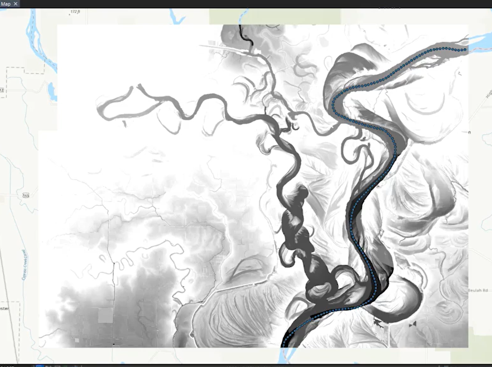
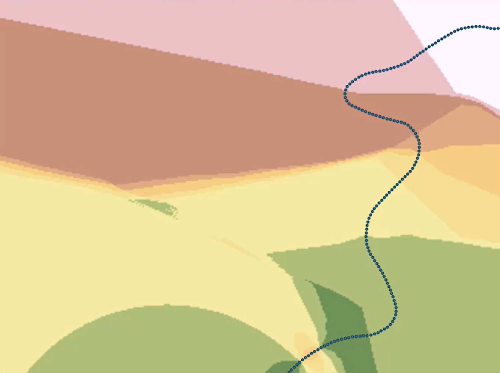
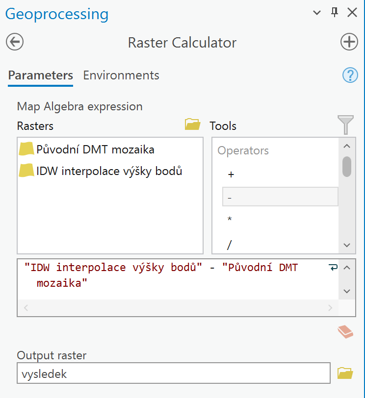
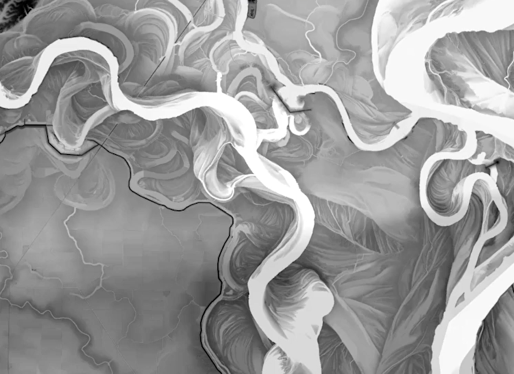

# Mapová algebra

## Cíl cvičení

Použití mapové algebry v rámci rastrového kalkulátoru pro výpočet relativního elevačního modelu řeky.

## Základní pojmy

- **Mapová algebra** – překryvné operace rastrů
- **Rastrová kalkulačka** – nástroj spouštějící výrazy Mapové algebry
- **DMT (digitální model terénu)** – digitální reprezentace prostorových objektů (obecný pojem obsahující různé způsoby vyjádření terénního reiéfu nebo povrchu)
- **DMR (digitální model reliéfu)** – digitální reprezentace zemského povrchu (NEbsahuje vegetaci, lidské stavby)
- **DMP (digitální model povrchu)** – digitální reprezentace zemského povrchu (obsahuje vegetaci, lidské stavby, které jsou pevně spojené s reliéfem)
- **REM (relativní výškový model)** – DMT relativní k vodní hladině toku.

## Použité datové podklady

- [DMR 5G](../../data/#dmr-5g)

## Postup

1. Načtení DMT do ArcGIS Pro
2. Export dlaždic detailů zájmového území
3. Vytvoření mozaiky zájmového území z detailů
4. Zápis extrémních hodnot DMT
5. Změna symbologie a úprava extrémů
6. Vytvoření kopie mozaiky
7. Vytvoření nové liniové třídy prvků
8. Vektorizace středové linie toku
9. Tvorba bodů podél středové linie toku ve vhodé vzdálenosti. Vhodná vzdálenost lze určit pomocí nástroje meření.

<figure markdown>
  { width="600" }
  <figcaption>Body středové linie</figcaption>
</figure>

10. Přiřazení výšky vzniklým bodům. Lze pomocí nástroje Extract Values To Points.
11. IDW interpolace výšky

<figure markdown>
  { width="600" }
  <figcaption>IDW interpolace</figcaption>
</figure>

12. Zajištění shodného kartografického zobrazení a velikosti pixelu interpolovaného rastru a původního DMT. Lze provést pomocí nástroje Project Raster. Jde o nutnou podmínku pro správné fungování rastrové kalkulačky.
13. Odečtení původního rastru od interpolovaného pomocí rastrové kalkulačky.

<figure markdown>
  { width="400" }
  <figcaption>Rastrová kalkulačka</figcaption>
</figure>

14. Změna symbologie

<figure markdown>
  { width="600" }
  <figcaption>Výstup</figcaption>
</figure>
