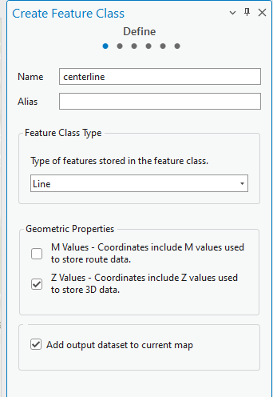
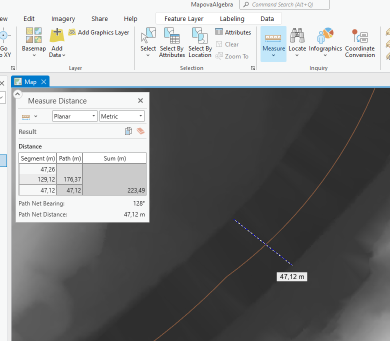
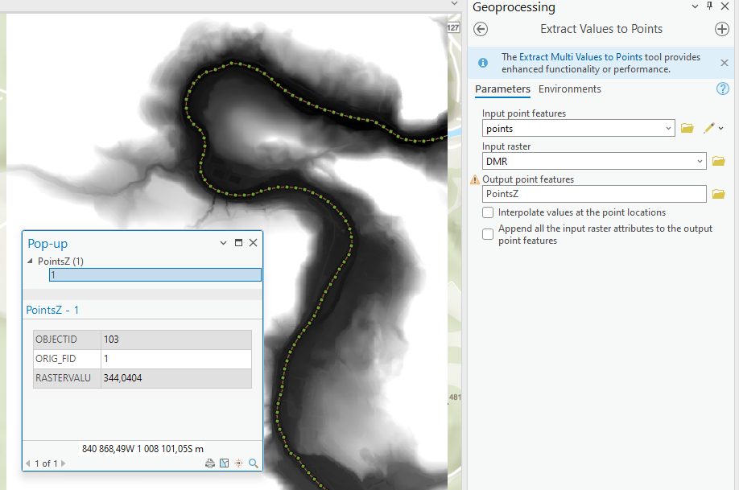
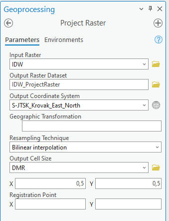

# Mapová algebra

## Cíl cvičení

Použití mapové algebry v rámci rastrového kalkulátoru pro výpočet relativního elevačního modelu řeky.

## Základní pojmy

- **Mapová algebra** – překryvné operace rastrů
- **Rastrová kalkulačka** – nástroj spouštějící výrazy Mapové algebry
- **DMT (digitální model terénu)** – digitální reprezentace prostorových objektů (obecný pojem obsahující různé způsoby vyjádření terénního reiéfu nebo povrchu)
- **DMR (digitální model reliéfu)** – digitální reprezentace zemského povrchu (NEbsahuje vegetaci, lidské stavby)
- **DMP (digitální model povrchu)** – digitální reprezentace zemského povrchu (obsahuje vegetaci, lidské stavby, které jsou pevně spojené s reliéfem)
- **REM (relativní výškový model)** – DMT relativní k vodní hladině toku.

### REM
<figure markdown>
  
  <figcaption>Rastrová mozaika</figcaption>
</figure>

Digitální relativní modely nám pomáhají lépe porozumět terénu. Při jejich vytváření se používá tzv. detrendovaný DMR bez vlivu nerovností. Tento detrendovaný DEM je následně odečten od DMR, což je digitální model povrchu. REM je užitešný pro vizualizaci říčních tvarů, které mohou být obtížně rozeznatelné pouze z leteckých snímků či DMR. Identifikace těchto tvarů má velkou vypovídací hodnotu při studiu migrace koryt a povodní, stejně jako při dalších úkonech spojených se stavebními pracemi či výskytu živočichů.

Z REM lze identifikovat následující prvky:
- Stržová eroze,
- meandr s přiléhajícími hřbety a koryty ve tvaru půlměsíce
- slepá ramena
- izolovaná povodeň,
- hráz.

<figure markdown>
  { width="800" }
  <figcaption>Říční tvary</figcaption>
</figure>

[REM Story mapa](https://storymaps.arcgis.com/stories/19b6bfe0c3aa454c853bd6d9b7228adf){ .md-button .md-button--primary .button_smaller .external_link_icon target="_blank"}
{: .button_array}

## Použité datové podklady

- [DMR 5G](../../data/#dmr-5g)

## Postup
**1.** __Stažení dat__
Z Geoportálu Zeměměřického Úřadu si stáhněte dlažice DMR5G na části Vámi vybrané řeky. Zazipované soubory *.laz rozbalte a připojte do ArcGIS Pro.

{: .process_container}

<figcaption>Stažení dat z Geoportálu ZÚ</figcaption>

???+ note "&nbsp;Pozn."
     Je vhodné vybrat oblast, kde má řeka možnost měnit svůj tvar v čase. Ideální jsou tedy zájmová území s rovinatým charakterem, kde se tvoří meandry, slepá ramena, či záplavy. Protékající řeka údolím nemá pro změny toku dostatek prostoru a tvorba relativního výškového modelu nemá pro následující analýzy smysl.

**2.** __Založení projektu v ArcGIS Pro__

Po založení je nutné nastavit souřadnicový systém mapy na __S-JTSK Krovak EastNorth__ (EPSG:5514)

**3.** __Konverze LAZ souborů__

{: .process_container}

<figcaption>Převod *.laz souborů na *.las</figcaption>

???+ note "&nbsp;Pozn."
     - Nástroj lze spustit buď pro každý soubor zvlášť nebo spustit dávkově (viz cv. 1: [Batch Processing](../cviceni1/#batch-geoprocessing))
     - Po aktualizaci připojené složky s daty se nám v záložce katalogu zobrazí konvertované las soubory mračna bodů

**4.** __Tvorba DMR__

???+ note "&nbsp;Pozn."
     - postup vysvětlen ve cv. 3: [Vytvoření digitálního modelu terénu](../cviceni3/#vytvoreni-digitalniho-modelu-terenu)
     - Velikost buňky volte dle s ohledem na přesnost dat
     - Vzhledem k prostorovému rozlišení produktu DMR5G zde vhodné nastavit hodnotu 2 metry (opravit v nové verzi)

**5.** __Tvorba rastrové mozaiky__ 
Ze vniklých dlaždic je nutné vytvořit jediný výškový rastr pomocí funkce __Mosaic To New Raster__.

{: .process_container}

<figcaption>Rastrová mozaika</figcaption>

**6.** __Odečtení extrémních hodnot__

Pomocí nástroje Explore na záložce Map zjistíme minimální a maximální nadmořskou výšku toku.

{: .process_container}

<figcaption>Odečtení maximální a minimální nadmořské výšky řeky z mozaiky</figcaption>

**7.** __Změna symbologie DMR__

Nově vytvořené mozaice DMR nastavíme vlastní symbologii podle zaznamenaných extrémních hodnot.
 - je možné upravit dle požadovaného výsledku

{: .process_container}

<figcaption>Úprava symbologie DMR</figcaption>

???+ note "&nbsp;Pozn."
    Extrémní hodnoty lze přizpůsobit, aby byla dobře vidět kostra řeky i s přítoky.

**8.** __Tvorba kopie DMR__

**9.** __Středová čára řeky__
Abychom mohli vypošítat výškový model vstažený k povrchu řeky, je nutné vytvořit bodovou vrstvu s informacemi o nadmořské výšce a následně z nich vytvořit interpolovaný rastr. Nejdříve je nutné založit novou třídu prvků a nakreslit středovou čáru řeky, podle které následně vygenerujeme body. 

{: .process_container}

<figcaption>Tvorba středové čárky řeky</figcaption>

**10.** __Body podél středové čáry__
Body vytvoříme pomocí nástroje __Generate Points Along Lines__. Vzdálenost mezi nimi nastavíme na šířku řeky. 

???+ note "&nbsp;Pozn."
    Šířku řeky můžeme zjistit pomocí nástroje __Measure__ (měření) na záložce __Map__.

    
    {: .process_container}
    
    <figcaption>Nástroj měření</figcaption>

**11.** __Informace o nadmořské výšce__

Pomocí funkce __Extract Values to Points__ lze bodům přiřadit hodnoty pixelu, na jehož místě se bod nachází.

{: .process_container}

<figcaption>Přiřazení výšky bodům</figcaption>

**12.** __interpolace IDW__

Nyní můžeme z výškových bodů vytvořit interpolovaný výškový rastr vztažený k hladině řeky. Použijeme metodu vážené inverzní vzdálenost (IDW).

{: .process_container}

<figcaption>Interpolace</figcaption>

???+ note "&nbsp;Pozn."
    V geoprocessingovém nástroji __IDW__ je na záložce Enviroments nastavit rozsah, na kterém se interpolace provede. Výchozí nastavení je na rozsah interpolované vrstvy tj. naše bodová vrstva. My však chceme interpolovat na rozsah původního DMR vytvořeného z mozaiky. 

**13.** __Převzorkování__

Interpolovaný rastr je nutné převzorkovat, aby velikost pixelu odpovídala původnímu DMR. K převzorkování využijeme nástroj __Project Raster__
  - nutné pro práci s rastrovou kalkulačkou

{: .process_container}

<figcaption>Převzorkování rastru a kontrola velikosti pixelu</figcaption>

**14.** __Výpočet REM__

DRM vypočteme pomocí nástroje __Raster Calculator__ odečtením původní DMR od interpolovaného rastru vztaženého k hladině řeky.

{: .process_container}

<figcaption>Rastrová kalkulačka</figcaption>

**15.** __Změna symbologie výsledného REM__
Nyní už je je na nás, jak výsledný výsledný REM vizualizujeme. Vhodné je rastr vizualizovat metodou Stretch pomocí spojité barevné stupnice.

{: .process_container}

<figcaption>Vizualizace výsledku</figcaption>

## Zdroje
Relative Elevation Models [online]. MONTANA STATE LIBRARY [cit. 2024-01-25]. Dostupné z: [https://storymaps.arcgis.com/stories/19b6bfe0c3aa454c853bd6d9b7228adf](https://storymaps.arcgis.com/stories/19b6bfe0c3aa454c853bd6d9b7228adf)

Relative Elevation Model in ArcGIS Pro [online]. esri video [cit. 2024-01-25]. Dostupné z: [https://mediaspace.esri.com/media/t/1_pn5ltf54](https://mediaspace.esri.com/media/t/1_pn5ltf54)

