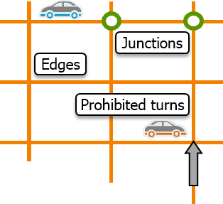
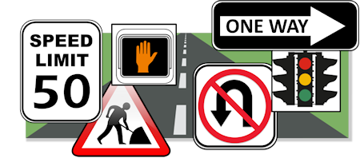
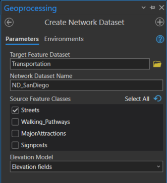
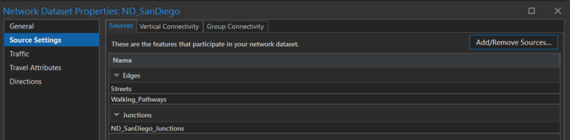
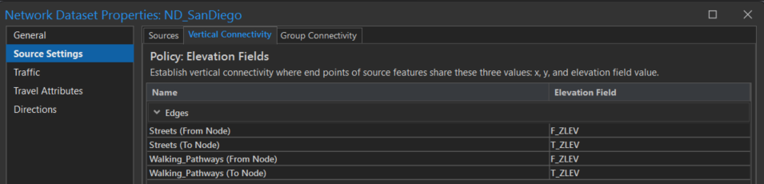
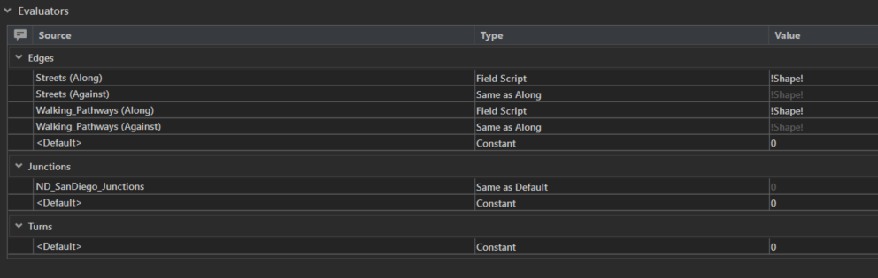
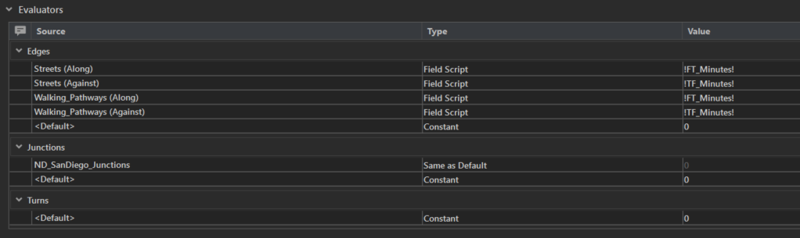

# Síťové analýzy

Ve cvičení se naučíte
{: align=center style="font-size: 1.25rem; font-weight: bold; margin-bottom: 10px;"}

-   :material-graph-outline:{ .xxxl .middle }
    {.middle style="display:table-cell;min-width:40px;padding-right:.8rem;"}

    vytvářet a pracovat s __network datasety__{: .primary_colorx}
    {.middle style="display:table-cell;line-height:normal;"}

-   :material-map-marker-distance:{ .xxxl .middle }
    {.middle style="display:table-cell;min-width:40px;padding-right:.8rem;"}
    
    najít __nejrychlejší__ a __optimální__{: .primary_colorx} trasu
    {.middle style="display:table-cell;line-height:normal;"}

## Základní pojmy

Síťová analýza v geografických informačních systémech umožňuje řešit různé otázky spojené s propojením bodů v prostoru pomocí sítě. Narozdíl od vzdálenostních analýz nepracují síťové analýzy s rastrovými, ale __vektorovými daty__{: .primary_color} (resp. používáme tzv. __network dataset__{: .primary_color})

???+ note "&nbsp;Pozn."
      *Network datasety* se používají k modelování reálných dopravních sítí. Obsahují nejen umístění a atributy ulic a dálnic, ale také informace o jejich vzájemném vztahu. Silnice mohou být propojené, mohou mít povolené nebo zakázané odbočky a mohou poskytovat další podrobnosti, které ovlivňují, jaké cestovní trasy jsou možné a jak dlouho může cesta trvat.

      [What is a network dataset?](https://pro.arcgis.com/en/pro-app/latest/help/analysis/networks/what-is-network-dataset-.htm){ .md-button .md-button--primary .button_smaller .external_link_icon target="_blank"}
      {: .button_array}

Některé z hlavních otázek, které lze pomocí síťové analýzy v GIS řešit, zahrnují:

<!-- https://www.neoteroi.dev/mkdocs-plugins/cards/ -->
::cards:: cols=3 class_name="center_align"

- title: Nejkratší cesta
  content: Jak najít __nejkratší__ nebo __optimální trasu__ mezi __dvěma body__ na síti?   <em class="primary_color no_dec"><svg xmlns="http://www.w3.org/2000/svg" viewBox="0 0 24 24"><path d="M11 15H6l7-14v8h5l-7 14v-8Z"></path></svg>například</em>
   plánování tras, doručování zásilek, optimalizace přepravy
  image: ../assets/cviceni7/Best_route.png

- title: Optimalizace tras
  content: Jak __optimalizovat trasu__ při navštěvování __více bodů__ s omezeními jako jsou čas, vzdálenost nebo priorita návštěvy?  <em class="primary_color no_dec"><svg xmlns="http://www.w3.org/2000/svg" viewBox="0 0 24 24"><path d="M11 15H6l7-14v8h5l-7 14v-8Z"></path></svg> například</em>
   kurýrní služby, sběr dat nebo technická údržba
  image: ../assets/cviceni7/Planning_routes.png

- title: Analýza dosažitelnosti
  content: Jaké __oblasti jsou dosažitelné z daného bodu__ v určitém časovém nebo vzdálenostním limitu?   <em class="primary_color no_dec"><svg xmlns="http://www.w3.org/2000/svg" viewBox="0 0 24 24"><path d="M11 15H6l7-14v8h5l-7 14v-8Z"></path></svg> například</em>
   stanovení oblastí pokrytých konkrétním bodem (např. služby, nemocnice)
  image: ../assets/cviceni7/Service_areas.png

- title: Nejbližší středisko obsluhy
  content: Hledá cestu mezi místem (*Incident*) a servisními středisky (*Facilities*), resp. určuje __nejsnáze dosažitelné středisko__ vzhledem k místu incidentu.  <em class="primary_color no_dec"><svg xmlns="http://www.w3.org/2000/svg" viewBox="0 0 24 24"><path d="M11 15H6l7-14v8h5l-7 14v-8Z"></path></svg> například</em>
   nejbližší hasičské stanice, které zasahují při požáru
  image: ../assets/cviceni7/Fire.png

- title: OD matice
  content: Analýza matice nákladů mezi výchozími a cílovými místy (*Origin-destination cost matrix*) vypočítá __nejméně nákladné__ síťové cesty z __výchozích__ míst do __cílových míst__. Jejím výstupem jsou liniové prvky, které spojují výchozí místa s místy určení. Každý liniový prvek ukládá celkové síťové náklady na cestu jako hodnotu atributu.
  image: ../assets/cviceni7/OD_cost_matrix.png

- title: Lokační a alokační analýza
  content: Tzv. *Location-allocation* analýza __pomáhá vybrat__, která __zařízení__ ze sady vstupních mají být provozována __na základě__ jejich potenciální __interakce s místy poptávky__.  <em class="primary_color no_dec"><svg xmlns="http://www.w3.org/2000/svg" viewBox="0 0 24 24"><path d="M11 15H6l7-14v8h5l-7 14v-8Z"></path></svg> například</em>
   kde otevřít novou pobočku podniku pro maximalizovaci podílu na trhu
  image: ../assets/cviceni7/location-allocation1.png

::/cards::

### **Network dataset**
Network datasety se skládají ze síťových prvků (*network elements*). Síťové prvky se vytvářejí ze zdrojových prvků použitých k vytvoření network datasetu, např. třídy prvků obsahující údaje o silnicích. Geometrie zdrojových prvků pomáhá vytvořit propojení v datové sadě sítě, aby ji bylo možné použít pro analýzu.

Existují tři hlavní typy síťových prvků:

1. __Hrany__ (*edges*) se připojují k ostatním prvkům pomocí křižovatek a jsou spojnicemi, po kterých cestují agenti. Lineární třídy zdrojových prvků se v souboru síťových dat stávají prvky hran. Hrany jsou také směrové, takže může existovat jak hrana Od-do, tak hrana Do-od.

2. __Křižovatky__ (*junctions*) spojují hrany a usnadňují navigaci z jedné hrany na druhou. Křižovatky pocházejí z vrcholů nebo bodových prvků, které představují křižovatky ulic v silniční síti.

3. __Odbočky__ (*turns*) uchovávají informace, které mohou ovlivnit pohyb mezi dvěma nebo více hranami.

<figure markdown>
  
  <figcaption>Základní prvky netowrk dataetů</figcaption>
</figure>

Hrany a spoje (křižovatky) tvoří základní strukturu každé sítě. Odbočky jsou nepovinné prvky, které uchovávají informace o pohybu v síti určitým směrem. Například odbočení doprava může být omezeno z jedné konkrétní hrany na jinou.

Síťové prvky mají atributy, které řídí navigaci v síti. Pro analýzu jsou atributy nezbytné a slouží k uchovávání podrobností a vlastností o souboru síťových dat. Existují čtyři druhy atributů:

1. __Náklady__ (*cost*) fungují jako překážky (impedance), které penalizují průchod přes prvek v síti. Síťové datové sady musí mít alespoň jeden nákladový atribut. Pokud existuje ve třídě prvků číselné pole reprezentující délku nebo čas, lze pole použít k vytvoření atributu nákladů.
    
    <em class="primary_color no_dec"><svg xmlns="http://www.w3.org/2000/svg" viewBox="0 0 24 24"><path d="M11 15H6l7-14v8h5l-7 14v-8Z"></path></svg> například</em> doba jízdy, délka úseku, povrch silnice (štěrkové cesty versus zpevněné)

2. __Deskriptory__ (*descriptor*) obsahují obecné informace, na které se často odkazuje jeden z ostatních tří typů atributů, a slouží k výpočtu jejich hodnot.
    
    <em class="primary_color no_dec"><svg xmlns="http://www.w3.org/2000/svg" viewBox="0 0 24 24"><path d="M11 15H6l7-14v8h5l-7 14v-8Z"></path></svg> například</em> počet jízdních pruhů, rychlostní limit

3. __Omezení__ (*restriction*) zakazují projíždět určitými okraji (cestami) v určitých směrech. Atribut omezení je buď zapnutý, nebo vypnutý, tj. omezený, nebo průjezdný.
    
    <em class="primary_color no_dec"><svg xmlns="http://www.w3.org/2000/svg" viewBox="0 0 24 24"><path d="M11 15H6l7-14v8h5l-7 14v-8Z"></path></svg> například</em> jednosměrná ulice, výstavba silnice, uzavírky, omezení jízdy

4. __Hierarchie__ (*hieararchy*) rozlišuje mezi typy silnic, což usnadňuje analýzu sítě, a umožňuje přiřadit souboru síťových dat prioritu.
    
    <em class="primary_color no_dec"><svg xmlns="http://www.w3.org/2000/svg" viewBox="0 0 24 24"><path d="M11 15H6l7-14v8h5l-7 14v-8Z"></path></svg> například</em> prioritní použití širších či rychlejších silnic, dálnice, magistrály, hlavní trasy, vedlejší trasy, vedlejší ulice

<figure markdown>
  
  <figcaption>Atributy síťových prvků.</figcaption>
</figure>

## Cvičení
**1.** Stáhněte si volně dostupná data z https://links.esri.com/NetworkAnalyst/TutorialData/Pro

**2.** Extrahujte stažený soubor, založte nový projekt v ArcGIS Pro a připojte v katalogu extrahovanou složku s daty (pomocí *Folder Connection*). V katalogu pak přidejte třídy prvků *Streets* a *Walking-Paths* z cesty *Tutorial > CreateNetworkDataset > SanDiego.gdb > Transportation*.

**3.** Prohlédněte si atributové tabulky obou vrstev. Pro budování network datasetu jsou významné zejména následující:

__FT_Minutes, TF_Minutes, KPH, Meters__{.outlined .no_dec} udávají náklady na průchod každou hranou; tato pole jsou obvykle typu double nebo float.

__F_ZLEV, T_ZLEV__{.outlined .no_dec} určují různé (výškové) úrovně ulic, resp. pomáhají správně vyhodnotit nadjezdy a podjezdy, kde nelze kvůli výškovému rozdílu přímo odbočit z jedné ulice do druhé.

__FUNC_CLASS__{.outlined .no_dec} reprezentuje kategorii každé silnice.

__PAVED, AR_PEDEST, AR_BUS, AR_AUTO, DIR_TRAVEL, TF_HeightLimit_Meters, FT_HeightLimit_Meters__{.outlined .no_dec} slouží obecně k nastavení omezení, která v určitých situacích brání jízdě po určitých silnicích; často mají hodnoty Y/N nebo např. obsahují údaje o jednosměrnosti (FT/TF) či výškovém limitu vozidla.

Pozn.: písmena __F__ a __T__ vyskytující se v názvech některých atributů zastupují anglické předložky __FROM__ a __TO__. V některých případech totiž může být nutné rozlišovat pohyb ve směru from-to a to-from po liniovém segmentu.

**4.** V katalogu pravým klikem nad feature datasetem *Transportation* (cesta: *Tutorial > CreateNetworkDataset > SanDiego.gdb > Transportation*) vybereme *New > Network Dataset*, čímž otevřeme dialogové okno nástroje geoprocessingu *Create Network Dataset*. Z mapového okna následně odstraňte nově vytvořený network dataset, jinak není možné editovat jeho nastavení.

<figure markdown>
  
  <figcaption>Nástroj na vytvoření Network datasetu.</figcaption>
</figure>

**5.** Network dataset byl jeprve vytvořen pouze z třídy prvků *Streets*. Nyní do datové sady sítě přidáte *Walking_Pathways* a nastavíte příslušné zásady skupinové a vertikální konektivity pro obě vstupní třídy prvků. Veškeré úpravy budou prováděny přes vlastnosti network datasetu (v katalogu po pravém kliknutí na network dataset vyberte *Properties*).

**6.** V první záložce *Sources* na listu *Source settings* se aktuálně nachází jeden zdroj hran (*edges*) a jeden křižovatek (*junctions*). Zdrojem křižovatek je defaultní třída prvků vytvořená a spravovaná přímo network datasetem. Pomocí *Add/Remove sources/ přidejte *Walking_Pathways*.

<figure markdown>
  
  <figcaption>Nastavení zdrojů.</figcaption>
</figure>

**7.** Na záložce *Vertical Connectivity** proběhne ošetření různé úrovně ulic. Pro *Streets* a *Walking_Pathways* zvolte atribut F_ZLEV (pro případy *From Node*), resp. T_ZLEV (*To Node*).

<figure markdown>
  
  <figcaption>Nastavení vertikálního propojení.</figcaption>
</figure>

**8.** V této části budete do network datasetu přidávat atributy nákladů. Nákladový atribut se používá k modelování impedance (náklady jsou poměrně rozděleny podél celé délky hrany). Na listu *Travel Attributes* v záložce *Costs* je prozatím obsažen jeden automaticky vytvořený náklad: *Length* (logicky vycházející z geometrie). Je nutné změnit editovat sekci *Evaluators* následujícím způsobem:

<figure markdown>
  
  <figcaption>Nastavení nákladů pole *Length*.</figcaption>
</figure>

Dále vytvoříme nový náklad (časový), který pojmenujte *Minutes*, zvolte tytéž jednotky a sekci *Evaluators* vyplňte tímto způsobem:

<figure markdown>
  
  <figcaption>Nastavení nákladů pole *Time*.</figcaption>
</figure>

Ve spodním řádku *Turns* změníme hodnoty *Type* na *Turn Category* a po rozkliknutí výrazu v kolonce *Type* změníme hodnoty *Left Turn* a *Reverse* na 5 vteřin.

<figure markdown>
  
  <figcaption>Nastavení nákladů pole *Time*.</figcaption>
</figure>

Veškeré změny potvrďte a zavřete dialogové okno.

TBA

## Úlohy k procvičení

!!! task-fg-color "Úlohy"

    K řešení následujích úloh použijte datovou sadu [ArcČR
    500](../../data/#arccr-500) verzi 3.3 dostupnou na disku *S* ve složče
    ``K155\Public\data\GIS\ArcCR500 3.3``.

    Postup:
    
    - Vytvoříme feature dataset 'komunikace'
    - Do tohoto datasetu naimportuje třídu prvků (feature class) 'Silnice' z ArcČR500
    - Do atributové tabulky nově vytvořené třídy prvků 'Silnice' přidáme sloupec 'rychlost' a na základě délky segmentů ('Shape_Length') vypočítáme čas v minutách nutný pro průjezd segmentu: ``!SHAPE_Length! / ((!rychlost! * 1000) / 60)``
    - Vytvoříme network dataset
    
    Budeme uvažovat následující průměrné rychlosti pro silnice (viz
    [Wikipedia](http://cs.wikipedia.org/wiki/Omezen%C3%AD_rychlosti_na_pozemn%C3%ADch_komunikac%C3%ADch_v_%C4%8Cesku)):
    
    | Typ                 | Průměrná rychlost (km/h) |
    |---------------------|--------------------------|
    | Dálnice             |	130                      |
    | Rychlostní silnice  | 130                      |
    | Silnice 1.třídy	  | 90                       |
    | Silnice 2.třídy	  | 80                       |
    | Silnice 3.třídy	  | 70                       |
    | Neevidovaná silnice |	60                       |
    
    1. Určete na základě datové sady komunikací nejrychlejší cestu z
       nejvýchodněji položené obce v ČR (Hrčava) do nejzápadněji položené
       obce (Krásná). Kolik času tato cesta zabere?

    2. Jak je rozdíl v kilometrech nejkratší a nejrychlejší cesty mezi
       obcemi Hrčava a Krásná z předchozího příkladu. O kolik minut bude
       trvat déle nejkratší cesta?

    3. O kolik minut se prodlouží nejrychlejší cesta z obce Hrčava do obce
       Krásná v případě, že se vyhneme dálnicím a území Hlavního města
       Prahy?

    4. Jaká je výměra území v km^2^, kde je dojezdovost z nejbližšího
       letiště 3, 5 a 10min (uvažujte pouze komunikace 1.třídy a vyšší,
       letiště vzdálenější než 5km od nejbližší komunikace do výpočtu
       nezahrnujte)?
