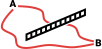
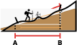
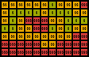

# Vzdálenostní analýzy

Ve cvičení se naučíte
{: align=center style="font-size: 1.25rem; font-weight: bold; margin-bottom: 10px;"}

-   :material-map-marker-distance:{ .xxxl .middle }
    {.middle style="display:table-cell;min-width:40px;padding-right:.8rem;"}
    
    že "__jak daleko od sebe__{: .primary_colorx}" znamená mnohem více než počet kilometrů mezi místy na mapě
    {.middle style="display:table-cell;line-height:normal;"}

-   :material-graph-outline:{ .xxxl .middle }
    {.middle style="display:table-cell;min-width:40px;padding-right:.8rem;"}

    jak lze analýzou vzdáleností vytvořit sofistikovanější __modely blízkých a vzdálených míst__{: .primary_colorx}
    {.middle style="display:table-cell;line-height:normal;"}

-   :material-nature-people-outline:{ .xxxl .middle }
    {.middle style="display:table-cell;min-width:40px;padding-right:.8rem;"}

    jak aplikovat koncepty analýzy vzdáleností k zodpovězení __reálných otázek__ týkajících se pohybu v krajině
    {.middle style="display:table-cell;line-height:normal;"}

## Základní pojmy

## Použité datové podklady

## Náplň cvičení

Vzdálenostní analýza pomáhá zodpovědět základní otázku týkající se geografických dat: __Jak daleko jsou od sebe různá místa?__

__"Jak daleko"__ ovšem může znamenat víc než jen vzdálenost (počet kilometrů mezi body). Analýza může také zohlednit ujetou __povrchovou vzdálenost__, nutnost __obejít překážky__ a __náročnost terénu__. Je vhodná v situacích, kdy je třeba modelovat __pohyb po krajině__. Jedná se o analýzu rastrovou.

Pro analýzy vzdálenosti lze použít __tři základní metody__{: .primary_color}:

<!-- https://www.neoteroi.dev/mkdocs-plugins/cards/ -->
::cards:: cols=3 class_name="center_align"

- title: Distance Accumulation
  content: Každému pixelu přiřazuje __hodnotu obtížnosti __(součet nákladů)__ dosažení __(jednoho)__ zdrojového bodu__.  <em class="primary_color no_dec"><svg xmlns="http://www.w3.org/2000/svg" viewBox="0 0 24 24"><path d="M11 15H6l7-14v8h5l-7 14v-8Z"></path></svg> například</em>
   oblast potenciální polohy ztraceného člověka v čase od poslední známé polohy
  image: ../assets/cviceni7/01.svg

- title: Distance Allocation
  content: Každému pixelu __přiřazuje zdrojový bod__, ke kterému vede __nejsnadnější cesta__ (dle součtu nákladů).  <em class="primary_color no_dec"><svg xmlns="http://www.w3.org/2000/svg" viewBox="0 0 24 24"><path d="M11 15H6l7-14v8h5l-7 14v-8Z"></path></svg> například</em>
   přiřazení nejbližšího záchranného zařízení, nebo mapování zvířecích teritorií
  image: ../assets/cviceni7/02.svg

- title: Path Generation
  content: Generuje __cestu s nejnižšími náklady__ mezi dvěma (a více) body.   <em class="primary_color no_dec"><svg xmlns="http://www.w3.org/2000/svg" viewBox="0 0 24 24"><path d="M11 15H6l7-14v8h5l-7 14v-8Z"></path></svg> například</em>
   pohyb zvířat mezi zdroji potravy, nebo stavba cesty v krajině
  image: ../assets/cviceni7/03.svg

::/cards::

### Faktory ovlivňující analýzu (vstupní data)

-   :material-source-commit-end:{ .lg .middle } __Pozice zdroje__ (1 a více)

    

    Body (pixely), z jejichž pozic probíhá výpočet  
    &nbsp;

    { width=160px .off-glb .no-filter }
    {: align=center}
        
-   :fontawesome-solid-road-barrier:{ .lg .middle } __Překážky__ (Barriers)

    

    Struktury blokující cestu, neumožňují průchod

    _:material-lightning-bolt: například_{.primary_color .no_dec} zdi, řeky, dálnice, státní hranice apod.

    { width=160px .off-glb .no-filter }
    {: align=center }

    [Account for barriers in distance calculations](https://pro.arcgis.com/en/pro-app/latest/tool-reference/spatial-analyst/account-for-barriers-in-distance-calculations.htm){ .md-button .md-button--primary .button_smaller .external_link_icon target="_blank"}
    {: .button_array}

-   :material-map-marker-distance:{ .lg .middle } __Povrchová vzdálenost__ (Surface Distance)

    

    Započítává nerovnosti povrchu Země (reliéf), cesta je pak delší než přímá spojnice.

    { width=160px .off-glb .no-filter }
    {: align=center}

    [Account for surface in distance calculations](https://pro.arcgis.com/en/pro-app/latest/tool-reference/spatial-analyst/account-for-surface-in-distance-calculations.htm){ .md-button .md-button--primary .button_smaller .external_link_icon target="_blank"}
    {: .button_array}

-   :fontawesome-solid-hand-holding-dollar:{ .lg .middle } __Náklady__ (Cost, Friction)

    

    Rozlišuje prostupnost rastru ve smyslu nákladů

    _:material-lightning-bolt: například_{.primary_color .no_dec} Land Cover, sklonitost terénu nebo nadm. výška, ale i cena výkupu pozemků, cena za překročení hranice.

    *[Land Cover]: les/louka/bažina/cesta
    *[sklonitost terénu]: strmější = náročnější pohyb
    *[nadm. výška]: vyšší polohy = náročnější pohyb
    *[cena výkupu pozemků]: pro stavbu cest
    *[cena za překročení hranice]: vstupné a jiné poplatky

    <!-- ALTERNATIVA S ANOTACEMI
    _:material-lightning-bolt: například_{.primary_color .no_dec} Land Cover(1), sklonitost terénu(2) nebo nadm. výška(3), ale i cena výkupu pozemků(4), cena za překročení hranice(5).
    { .annotate }

    1.  les/louka/bažina/cesta
    2.  strmější = náročnější pohyb
    3.  vyšší polohy = náročnější pohyb
    4.  pro stavbu cest
    5.  vstupné a jiné poplatky -->

    { width=160px .off-glb .no-filter }
    {: align=center}

    [Cost Raster Definition](https://support.esri.com/en-us/gis-dictionary/cost-raster){ .md-button .md-button--primary .button_smaller .external_link_icon target="_blank"}
    {: .button_array}

!!! note-grey "Poznámka"

    U těchto rastrových analýz nelze při výpočtu rozlišovat směr pohybu (např. nahoru a dolů). Náklady se přičítají shodně s překročením pixelu v jakémkoli směru.

Při výběru konkrétních nákladů je vždy nutné __správně vyhodnotit jednotlivé faktory__. Vliv jednotlivých faktorů se může případ od případu výrazně lišit.

_:material-lightning-bolt: například:_{.primary_color .no_dec}

- Bariéra pro člověka nemusí znamenat bariéru pro zvíře
- Les pohyb člověka zpomaluje, ale zvířata ho mohou naopak preferovat
- Povrchová vzdálenost se nemusí vztahovat na ptáky nebo letadla

Jednotlivé faktory mohou mít v analýze také __odlišnou váhu__, viz níže.

[pro.arcgis.com How distance accumulation works](https://pro.arcgis.com/en/pro-app/latest/tool-reference/spatial-analyst/how-distance-accumulation-works.htm){ .md-button .md-button--primary .server_name .external_link_icon_small target="_blank"}
[pro.arcgis.com Distance accumulation algorithm](https://pro.arcgis.com/en/pro-app/latest/tool-reference/spatial-analyst/distance-accumulation-algorithm.htm){ .md-button .md-button--primary .server_name .external_link_icon_small target="_blank"}
{: .button_array}

## Zadání domácího úkolu k semestrální práci

## Zdroje

https://www.esri.com/training/catalog/61d4dddd118ffc20ea87afa5/distance-analysis-essentials/

Network Datasety:

https://www.esri.com/training/catalog/64c94671e9b24307fd5db5ca/configure-a-network-dataset-in-arcgis-pro/

https://www.esri.com/training/catalog/57672875eeae7ade2869a2f1/finding-the-best-paths/

https://pro.arcgis.com/en/pro-app/latest/tool-reference/spatial-analyst/account-for-surface-in-distance-calculations.htm

https://pro.arcgis.com/en/pro-app/latest/tool-reference/spatial-analyst/distance-analysis.htm

https://pro.arcgis.com/en/pro-app/latest/tool-reference/spatial-analyst/creating-a-cost-surface-raster.htm

https://pro.arcgis.com/en/pro-app/latest/tool-reference/spatial-analyst/understanding-cost-distance-analysis.htm

:custom-vc-numeric-11-box:

:material-numeric-7-box:

:mountain:{ .xxxl}