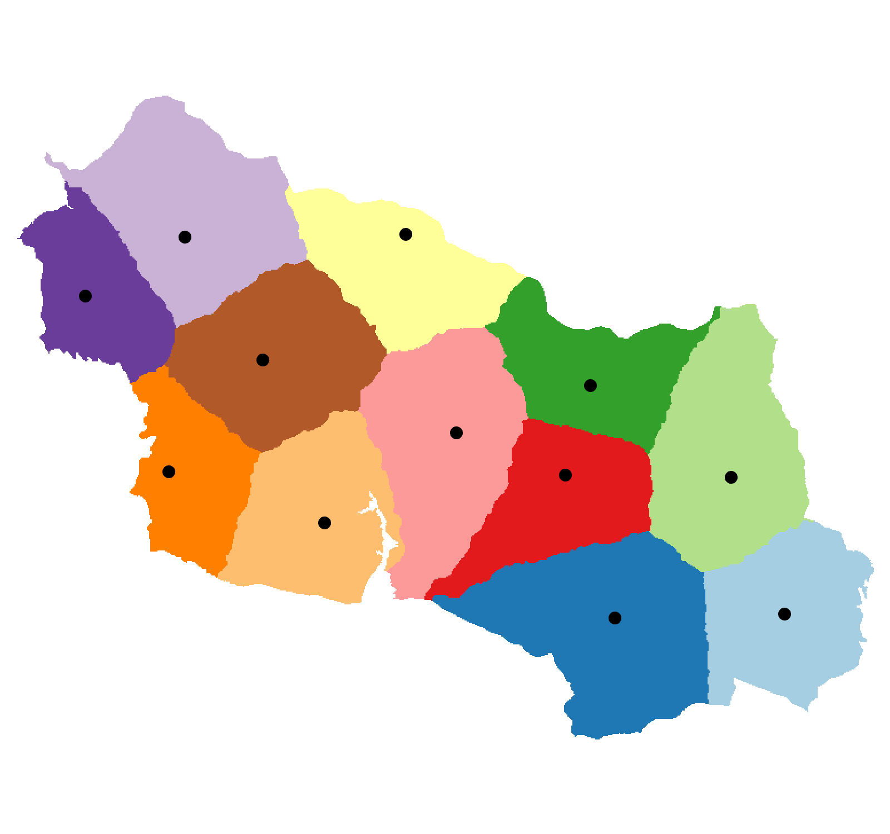
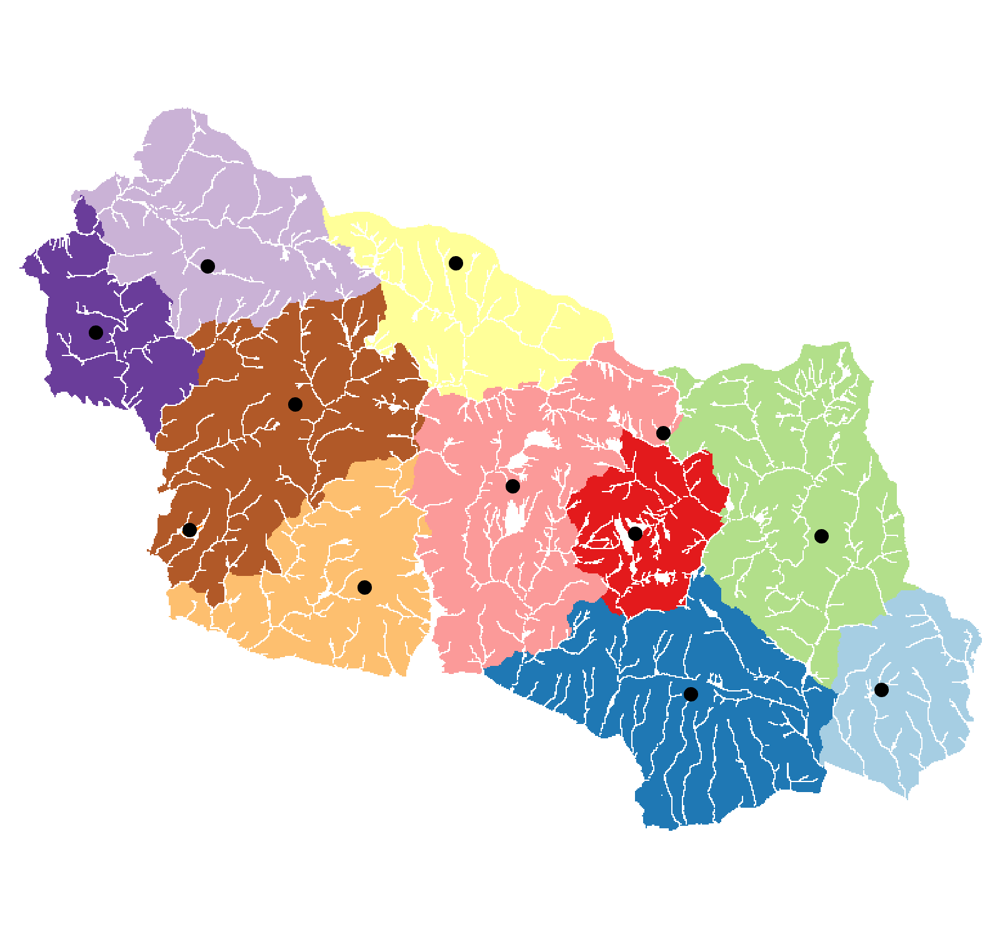

# Vzdálenostní analýzy

Ve cvičení se naučíte
{: align=center style="font-size: 1.25rem; font-weight: bold; margin-bottom: 10px;"}

-   :material-map-marker-distance:{ .xxxl .middle }
    {.middle style="display:table-cell;min-width:40px;padding-right:.8rem;"}
    
    že "__jak daleko od sebe__{: .primary_colorx}" znamená mnohem více než počet kilometrů mezi místy na mapě
    {.middle style="display:table-cell;line-height:normal;"}

-   :material-graph-outline:{ .xxxl .middle }
    {.middle style="display:table-cell;min-width:40px;padding-right:.8rem;"}

    jak lze analýzou vzdáleností vytvořit sofistikovanější __modely blízkých a vzdálených míst__{: .primary_colorx}
    {.middle style="display:table-cell;line-height:normal;"}

-   :material-nature-people-outline:{ .xxxl .middle }
    {.middle style="display:table-cell;min-width:40px;padding-right:.8rem;"}

    jak aplikovat koncepty analýzy vzdáleností k zodpovězení __reálných otázek__ týkajících se pohybu v krajině
    {.middle style="display:table-cell;line-height:normal;"}

## Náplň cvičení

Vzdálenostní analýza pomáhá zodpovědět základní otázku týkající se geografických dat: __Jak daleko jsou od sebe různá místa?__

__"Jak daleko"__ ovšem může znamenat víc než jen vzdálenost (počet kilometrů mezi body). Analýza může také zohlednit ujetou __povrchovou vzdálenost__, nutnost __obejít překážky__ nebo __náročnost terénu__.

Jedná se o __analýzu rastrovou__, proto je vhodná pro modelování __pohybu po povrchu__ (po krajině). Druhým (vektorovým) typem vzdálenostích analýz jsou pak tzv. analýzy síťové (součástí [budoucího cvičení](../cviceni/cviceni8.md "cvičení 8"){ style="color:unset;border-bottom:.05rem dotted var(--md-default-fg-color--light)" }).

---

### Faktory ovlivňující analýzu (vstupní data)

-   :material-source-commit-end:{ .lg .middle } __Pozice zdroje__ (1 a více)

    

    Body (pixely), z jejichž pozic probíhá výpočet  
    &nbsp;

    { width=160px .off-glb .no-filter }
    {: align=center}
        
-   :fontawesome-solid-road-barrier:{ .lg .middle } __Překážky__ (Barriers)

    

    Struktury blokující cestu, neumožňují průchod

    _:material-lightning-bolt:například_{.primary_color .no_dec} zdi, řeky, dálnice, státní hranice apod.

    { width=160px .off-glb .no-filter }
    {: align=center }

    [Account for barriers in distance calculations](https://pro.arcgis.com/en/pro-app/latest/tool-reference/spatial-analyst/account-for-barriers-in-distance-calculations.htm){ .md-button .md-button--primary .button_smaller .external_link_icon target="_blank"}
    {: .button_array}

-   :material-map-marker-distance:{ .lg .middle } __Povrchová vzdálenost__ (Surface Distance)

    

    Započítává nerovnosti povrchu Země (reliéf), trasa pak lépe odpovídá skutečné uražené vzdálenosti. Použití se hodí, pokud nás zajímá kromě tvaru trasy __i její skutečná délka__.

    { width=160px .off-glb .no-filter }
    {: align=center}

    [Account for surface in distance calculations](https://pro.arcgis.com/en/pro-app/latest/tool-reference/spatial-analyst/account-for-surface-in-distance-calculations.htm){ .md-button .md-button--primary .button_smaller .external_link_icon target="_blank"}
    {: .button_array}

-   :fontawesome-solid-hand-holding-dollar:{ .lg .middle } __Náklady__ (Cost, Friction)

    

    Rozlišuje prostupnost rastru ve smyslu nákladů, hodnota pixelu znamená obtížnost (náklady) jeho překročení

    _:material-lightning-bolt:například_{.primary_color .no_dec} __Land Cover__{.abbrev .no_dec .nowrap title="les/louka/bažina/cesta"}, __sklonitost terénu__{.abbrev .no_dec .nowrap title="strmější = náročnější pohyb"} nebo __nadm. výška__{.abbrev .no_dec .nowrap title="vyšší polohy = náročnější pohyb"}, ale i __cena výkupu pozemků__{.abbrev .no_dec .nowrap title="pro stavbu cest"}, __cena za překročení hranice__{.abbrev .no_dec .nowrap title="vstupné a jiné poplatky"}.

    <!-- { width=160px .off-glb .no-filter } -->{ width=260px .off-glb .no-filter }
    {: align=center}

    [Cost Raster Definition](https://support.esri.com/en-us/gis-dictionary/cost-raster){ .md-button .md-button--primary .button_smaller .external_link_icon target="_blank"}
    {: .button_array}

Dalšími vstupními činiteli mohou být tzv. __horizontální__ nebo __vertikální faktor__. Tyto parametry mění náklady trasy v závislosti na směru pohybu, konkrétně:

-   :material-arrow-all:{ .lg .middle } __Horizontální faktor__ (Horizontal Factor):

    

    Mění náklady __v závislosti na azimutu__ směřujícímu k dalšímu pixelu. Ideální k __započítání směru větru__ do výpočtu obtížnosti (nákladů) trasy.

    [Adjust the encountered distance using a horizontal factor](https://pro.arcgis.com/en/pro-app/latest/tool-reference/spatial-analyst/adjust-the-encountered-distance-using-a-horizontal-factor.htm){ .md-button .md-button--primary .button_smaller .external_link_icon target="_blank"}
    {: .button_array}

-   :material-arrow-up-down:{ .lg .middle } __Vertikální faktor__ (Vertical Factor):

    

    Mění náklady __v závislosti na úhlu sklonu terénu__, řídí se funkcí (lineární, trigonometrickou apod.) nebo tabulkou hodnot. Ideální k __rozlišení nákladů do kopce a z kopce__.

    [Adjust the encountered distance using a vertical factor](https://pro.arcgis.com/en/pro-app/latest/tool-reference/spatial-analyst/adjust-the-encountered-distance-using-a-vertical-factor.htm){ .md-button .md-button--primary .button_smaller .external_link_icon target="_blank"}
    {: .button_array}

!!! note-grey "Poznámka"

    Při použití těchto dvou faktorů už __analýzy závisí na směru trasy (tam ≠ zpět)__ a je proto vhodné dát pozor na nastavení parametru __Travel direction__{.outlined .no_dec} – __Travel from source__ × __Travel to source__ (od zdroje × ke zdroji)

[Distance Analysis: Using Distance Accumulation and Distance Allocation](https://www.esri.com/training/catalog/61a64df6a992c72fed4bb5db/distance-analysis-using-distance-accumulation-and-distance-allocation/){ .md-button .md-button--primary .button_smaller .external_link_icon target="_blank" title="e-learningový kurz s použitím Horizontal a Vertical Factor"}
{: .button_array}

__Doplňkové parametry:__

- __Initial accumulation__{.outlined .no_dec} nastaví zdrojovému bodu __počáteční hodnotu nákladů__, se kterou cesta z něj začíná
- __Maximum accumulation__{.outlined .no_dec} __maximální hodnota kumulovaných nákladů__, místa s vyššími náklady (pro daný zdrojový bod) budou mít hodnotu `Null`
- __Multiplier to apply to costs__{.outlined .no_dec} hodnota, kterou se __vynásobí náklady každého pixelu__, lze použít _:material-lightning-bolt:např._{.primary_color .no_dec} k rozlišení různých druhů dopravy

!!! note-grey "Poznámka"

    Při výběru konkrétních nákladů je vždy nutné __správně vyhodnotit jednotlivé parametry__. Vliv jednotlivých faktorů se může případ od případu výrazně lišit.

    _:material-lightning-bolt:například:_{.primary_color .no_dec}

    - Bariéra pro člověka nemusí znamenat bariéru pro zvíře
    - Les pohyb člověka zpomaluje, ale zvířata ho mohou naopak preferovat
    - Povrchová vzdálenost se nemusí vztahovat na ptáky nebo letadla

    Jednotlivé faktory mohou mít v analýze také __odlišnou váhu__, viz níže.

---

### Analýzy

Pro analýzy vzdálenosti lze použít __tři základní metody__{: .primary_color}:

<!-- https://www.neoteroi.dev/mkdocs-plugins/cards/ -->
::cards:: cols=3 class_name="center_align"

- title: Distance Accumulation
  content: Každému pixelu přiřazuje __hodnotu obtížnosti __(součet nákladů)__ dosažení __(jednoho)__ zdrojového bodu__.  <em class="primary_color no_dec"><svg xmlns="http://www.w3.org/2000/svg" viewBox="0 0 24 24"><path d="M11 15H6l7-14v8h5l-7 14v-8Z"></path></svg> například</em>
   oblast potenciální polohy ztraceného člověka v čase od poslední známé polohy
  image: ../assets/cviceni7/01.svg

- title: Distance Allocation
  content: Každému pixelu __přiřazuje zdrojový bod__, ke kterému vede __nejsnadnější cesta__ (dle součtu nákladů).  <em class="primary_color no_dec"><svg xmlns="http://www.w3.org/2000/svg" viewBox="0 0 24 24"><path d="M11 15H6l7-14v8h5l-7 14v-8Z"></path></svg> například</em>
   přiřazení nejbližšího záchranného zařízení, nebo mapování zvířecích teritorií
  image: ../assets/cviceni7/02.svg

- title: Path Generation
  content: Generuje __cestu s nejnižšími náklady__ mezi dvěma (a více) body.   <em class="primary_color no_dec"><svg xmlns="http://www.w3.org/2000/svg" viewBox="0 0 24 24"><path d="M11 15H6l7-14v8h5l-7 14v-8Z"></path></svg> například</em>
   pohyb zvířat mezi zdroji potravy, nebo stavba cesty v krajině
  image: ../assets/cviceni7/03.svg

::/cards::

---

### Metoda _Distance Accumulation_{.outlined}

Pro každý pixel vypočítá __kumulovanou vzdálenost__ (součet nákladů) __k nejbližšímu zdroji__. Distance Accumulation je základním nástrojem pro vzdálenostní analýzy a jeho výstupy bývají nutným vstupním parametrem některých navazujících nástrojů.

!!! note-grey "Poznámka"

    Do analýzy je možné započítat všechny výše zmíněné faktory.

 + překážky"){width="300px"}
 + překážky"){width="300px"}
 + překážky + parametr Maximum accumulation"){width="300px"}
{align="center"}

__:material-lightning-bolt:příklady použití:__{.primary_color .no_dec} identifikace odlehlých oblastí (daleko od stanic záchranné služby)

[pro.arcgis.com How distance accumulation works](https://pro.arcgis.com/en/pro-app/latest/tool-reference/spatial-analyst/how-distance-accumulation-works.htm){ .md-button .md-button--primary .server_name .external_link_icon_small target="_blank"}
[pro.arcgis.com Distance accumulation algorithm](https://pro.arcgis.com/en/pro-app/latest/tool-reference/spatial-analyst/distance-accumulation-algorithm.htm){ .md-button .md-button--primary .server_name .external_link_icon_small target="_blank"}
{: .button_array}

---

Předchozí metoda každému pixelu přiřadila náklady na cestu k nejbližšímu zdroji, ale neřekne nám, který zdroj je tím nejbližším. To dokáže metoda druhá:

### Metoda _Distance Allocation_{.outlined}

Každému pixelu __přiřadí hodnotu zdroje, ke kterému vede nejméně nákladná cesta__. V případě, že zadáme pouze nutné vstupní parametry (zdrojové body), bude se nástroj řídit pouze 2D vzdáleností a vytvoří tzv. [Thiessenovy polygony](https://support.esri.com/en-us/gis-dictionary/thiessen-polygon) (také [Voronoiovy diagramy](https://support.esri.com/en-us/gis-dictionary/voronoi-diagram)).

{width="250px"}
{width="250px"}
{width="250px"}
{width="250px"}
{align="center"}

__:material-lightning-bolt:příklady použití:__{.primary_color .no_dec} určení záchranného týmu nejblíže nouzové události

<!-- pak přidat výstupy s postupným přidáváním faktorů a zkusit najít zajímavé místo, kde v tom bude evidentní rozdíl a evidentní důvod (např. že to vybízí k přechodu jezera (kvůli nulovému sklonu), dokud mu to nezakážu bariérou nebo NODATA na vodě) -->

---

### Metoda _Path Generation_{.outlined}

Nalezne __spojnice bodů s nejnižsím součtem nákladů__. Nutným vstupem jsou dva rastry vzniklé nástrojem Distance Accumulation (&nbsp;__Output distance accumulation raster__{.outlined} a __Out back direction raster__{.outlined}&nbsp;)

__Příklady nejkratších tras:__

=== "1. pouze počátek a konec trasy"

    {width=50%}
    { align="center" }

=== "2. rastr překážek"

    {width=50%}
    { align="center" }

=== "3. rastr nákladů"

    {width=50%}
    { align="center" }

=== "4. rastr překážek + rastr nákladů"

    {width=50%}
    { align="center" }

<!-- tady určitě příklad jako je v prvním esri training kurzu v části 2 - různé obrázky

pak přidat výstupy s postupným přidáváním faktorů a zkusit najít zajímavé místo, kde v tom bude evidentní rozdíl a evidentní důvod (např. že to vybízí k přechodu jezera (kvůli nulovému sklonu), dokud mu to nezakážu bariérou nebo NODATA na vodě)

dvě místa a mezi nimi jezero sevřené horami

1. input, output (mělo by udělat rovnou čáru) <-- asi zbytečné, rovnou použít surface
2. input, output, surface (mělo by obejít horu, ale jít skrz jezero)
3. input, output, surface, cost (cost by byla vážená kombinace Land Cover+Trails v jednom a pak třeba Slope k tomu)
4. input, output, surface, cost, barriers (bariéra musí být tam, kde to ukázalo minulou cestu, aby se to od minula lišilo NEBO kolem jezer a řek kromě mostů)
5. input, output, surface, cost, barriers, vertical factor (mrknout na Training, tam mají nějaký texťák, nebo použít jednu z variant funkcí)

tohle samé asi i pro ty zbylé případy!!!

---

## Zadání domácího úkolu k semestrální práci

## Zdroje

https://www.esri.com/training/catalog/61d4dddd118ffc20ea87afa5/distance-analysis-essentials/

Network Datasety:

https://www.esri.com/training/catalog/64c94671e9b24307fd5db5ca/configure-a-network-dataset-in-arcgis-pro/

https://www.esri.com/training/catalog/57672875eeae7ade2869a2f1/finding-the-best-paths/

https://pro.arcgis.com/en/pro-app/latest/tool-reference/spatial-analyst/account-for-surface-in-distance-calculations.htm

https://pro.arcgis.com/en/pro-app/latest/tool-reference/spatial-analyst/distance-analysis.htm

https://pro.arcgis.com/en/pro-app/latest/tool-reference/spatial-analyst/creating-a-cost-surface-raster.htm

https://pro.arcgis.com/en/pro-app/latest/tool-reference/spatial-analyst/understanding-cost-distance-analysis.htm

:custom-vc-numeric-11-box:

:material-numeric-7-box:

:mountain:{ .xxxl}

možnosti úloh:

- stojím na náhodném místě v NP a chci spát -> ke které útulně to mám nejblíže? (distance allocation)
- a jak to k ní mám daleko? (distance accumulation s tou jednou konkrétní útulnou)
- a kudy k ní vede cesta? (path generation)
- -> ke kterému vodnímu zdroji to mám nejblíže? jak daleko? kudy vede cesta? (stejná úloha, akorát vodní zdroje jsou plochy a linie - jde to vůbec? zjistit! nelze použít land cover, protože nevidí potoky)

asi využít i bariéry nějak - daly by se vložit řeky jako bariéry s dírami v místech mostů

- člověk se ztratil v NP Krkonoše (známe bod poslední známé polohy a času) -> kam mohl za určitou dobu dojít? (buffery vzdáleností třeba po hodinách)
- jak přejít Krkonoše, abych nespal v NP, ale jen v ochranném pásmu? dá se to vůbec stihnout za jeden den mezi oblastmi, kde se to smí? (smí se to vlastně? v ochranném pásmu spát?)
- které oblasti nemají v dochozí vzdálenosti (třeba tří hodin) žádnou útulnu? (distance allocation to není! je to distance accumulation (NE dávkově) na všechny útulny, pak symbologií omezit extrémní místa NEBO distance accumulation na všechny útulny s maximem tří hodin a pak raster calculatorem NODATA->data a naopak data->NODATA (udělat inverzi data/NODATA))

bacha pokud by se u toho hikování používal ten vertical/horizontal factor, tak je tam pak důležitý ten Travel Direction (viz training 3, část 3 exercise)

---

- utíkám přes hranice (stačí mi cesta k hranicím, dál totiž nejsou data...), mám s sebou hodně věcí, takže mám malý výkon, útěk musím stihnout za jednu noc (za světla by mě chytili) – mám tedy omezený čas (pro accumulation), musím se vyhnout blízkosti stanovišť pohraničníků (bariéry, buffery kolem stanovišť převedené na linie by měly fungovat, případně použít polygony pokud to půjde) <-- bacha jak na to s výchozím místem, to jsem ještě nedomyslel, musí jich být diskrétní počet

cesty musí mít vysoký náklad, protože mě na nich někdo může vidět - vysokým nákladem se nezakáže přechod cesty, ale algoritmus se jim bude vyhýbat

- a pak OPAČNÝ PŘÍPAD – jsem komunista a chci zabránit útěkům přes hranice, mám peníze na dvě nová stanoviště pohraničníků, chci je postavit na dvou místech, která jsou nejdál od všech existujících stanovišť (a proto tam asi lidi teď utíkají)

---

- který vlk má největší teritorium a je tedy nejmenší šance, že na něj při přechodu krajiny narazím?

---

- zranil se turista -> který zácharnný tým to má ze stanice k němu nejblíž? (distance allocation)
- a pozor! záchranáři ho našli, ale potřebuje převoz vrtulníkem, který nemůže přistát v lese -> najdi nejbližsí místo mimo les (podle Land Cover) a cestu k tomu místu

---

- jak se dostat na kole do školy, abych jel jenom zkopce? (vyžadovalo by to ten)

doplňková informace - Corridor analysis, jen pro zajímavost, obrázky, co to je atd. je to v traning 4 část 3 -->