# Výpočetní nástroje QGIS

## Cíl cvičení

Probloubení znalostí platformy QGIS a jeho výpočetních nástrojů.

## Základní pojmy

- [**QGIS**](https://qgis.org) – svobodný a multiplatformní geografický informační systém (GIS)
    - [**Nástroje zpracování**](https://gismentors.github.io/qgis-pokrocily/geoprocessing/index.html)
    - [**Grafický modelář**](https://gismentors.github.io/qgis-pokrocily/modeler/index.html)

## Použité datové podklady

Cílem je používat data přímo od jejich poskytovatelů. Pro okrajové případy a případ technických problémů je ale připraven balíček již připravených dat.
- [data](https://geo.fsv.cvut.cz/vyuka/155gis2/cviceni/8/data.zip)

Přehled dat, které budeme používat:

- [Velkoplošná zvláště chráněná území](https://data.nature.cz/ds/3)  plošné vymezení chráněných oblastí. Data lze načítat přímo ze "ZIP", ale pro další zpracování se doporučuje data rozbalit do pracovního adresáře.
- rastrová data DMT 100x100m generalizovaná za účelem ukázky
- výsek z [DMR5G](https://ags.cuzk.cz/geoprohlizec/?atom=dmr5g) pro území obce Zdiby. Data byla stažena přímo od poskytovatele a oříznuta pro rychlejší zpracování území.

## Náplň cvičení

Jako podpůrný materiál budeme používat školící materiály [QGIS pro
začátečníky](https://gismentors.github.io/qgis-zacatecnik) a [QGIS pro pokročilé](https://gismentors.github.io/qgis-pokrocily/) skupiny
[GISMentors](https://gismentors.cz).

### Opakování základního ovládání a práce v QGIS

 
V panelu "Prohlížeč" si najdeme pracovní adresář se staženými daty. Dataset lze načít například "přetažením" datasetu  do mapového okna nebo do panelu vrstev. Načtená data je dobré zkontrolovat, zda se používá sprváný [souřadnicový systém](https://gismentors.github.io/qgis-zacatecnik/intro/import_export.html#vyber-souradnicoveho-systemu).

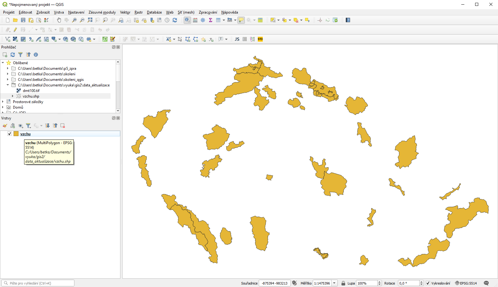

Vrstvě nastavíme kategorizovanou symbologii podle atributu "KAT".
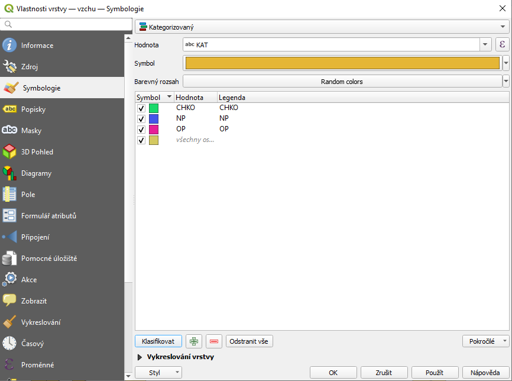

Základní nástroje jako například obalová zóna jsou k dipozici v horním textovém menu v položce "Vektor", konkrétně obalová zóna je zařazena "Vektor"->"Nástroje geoprocessingu"->"Obalová zóna...". Pracovně si  vygenerujeme obalovou zónu o velikosti 1000m sloučenou pro všechny prvky - "rozpuštěnou".
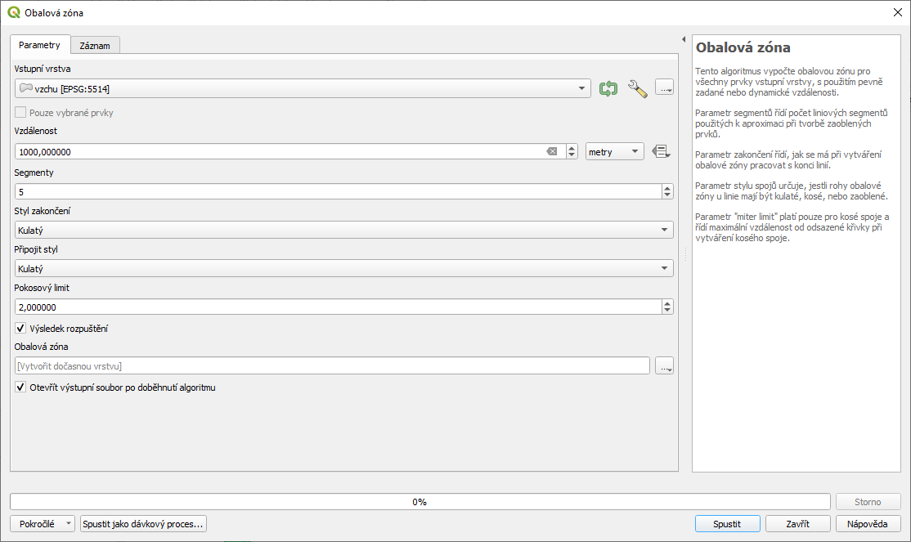
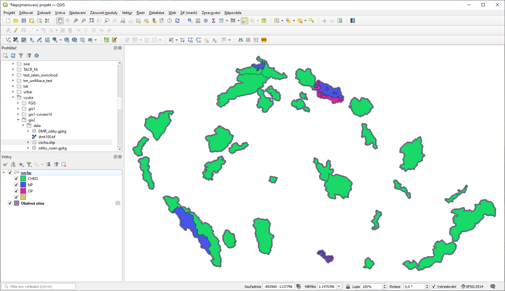

### Nástoje zpracování

Podklady:

- [Nástroje zpracování](https://gismentors.github.io/qgis-pokrocily/geoprocessing/index.html)

Menu "Nástroje zpracování" obsahuje širokou nabídku jak základních nástrojů, tak i mnoho dalších možností. Například možnost generování obalové zóny v mnohých variantách. Nástroj "Obalová zóna vektorové vrstvy" ze skupiny GDAL nám umožní rozpustit obalové zóny podle atributu.

Vygenerujeme obalovou zónu vrstvy VZCHU o velikosti 1000 m a parametr pro rozpuštění dle atributu nastavíme na atribut "KAT".
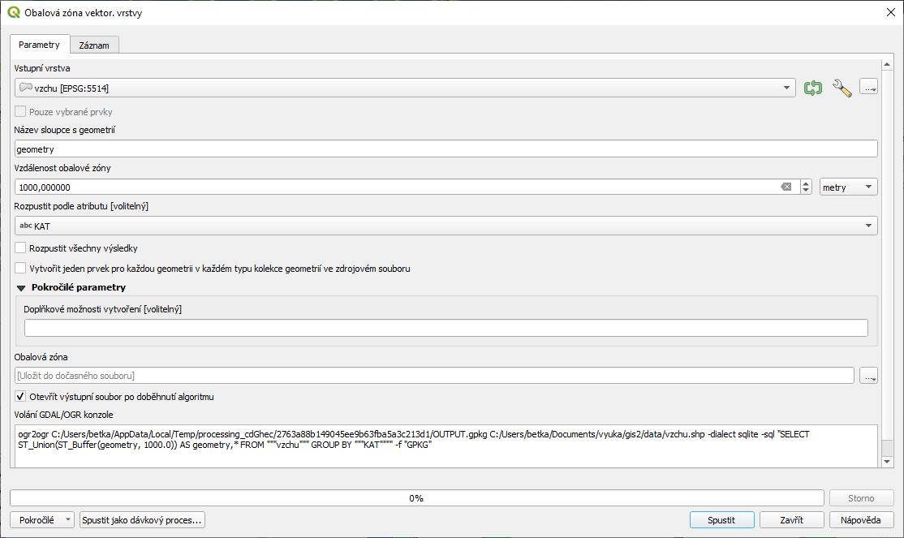

V symbologii nastavíme částečně průhlednou barvu. Díky překryvu původní kategorizované sybologie a pokročilé obalové zóny si umíme jednoduše zkontrolovat správnost funkcionality.
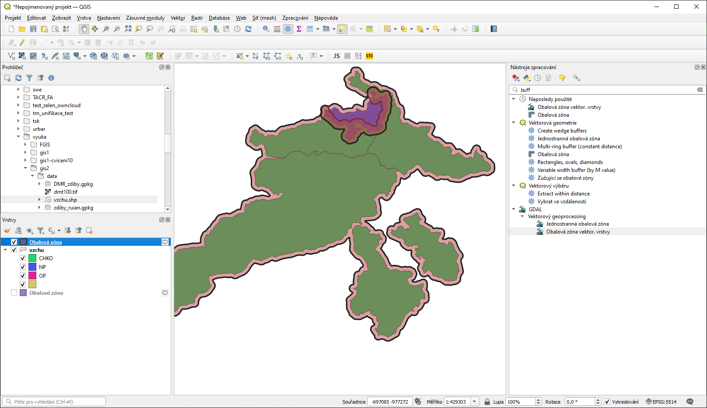

Načteme vrstvu DMT, ořežeme podle velkoplošných chráněných území - nástroj "Rastr"->"Extrakce"->"Oříznout rastr podle vrstvy masky". Zároveň použijeme nástroj pro iteraci, který nám vytvoří samostatný výstup pro každý prvek chráněného území.
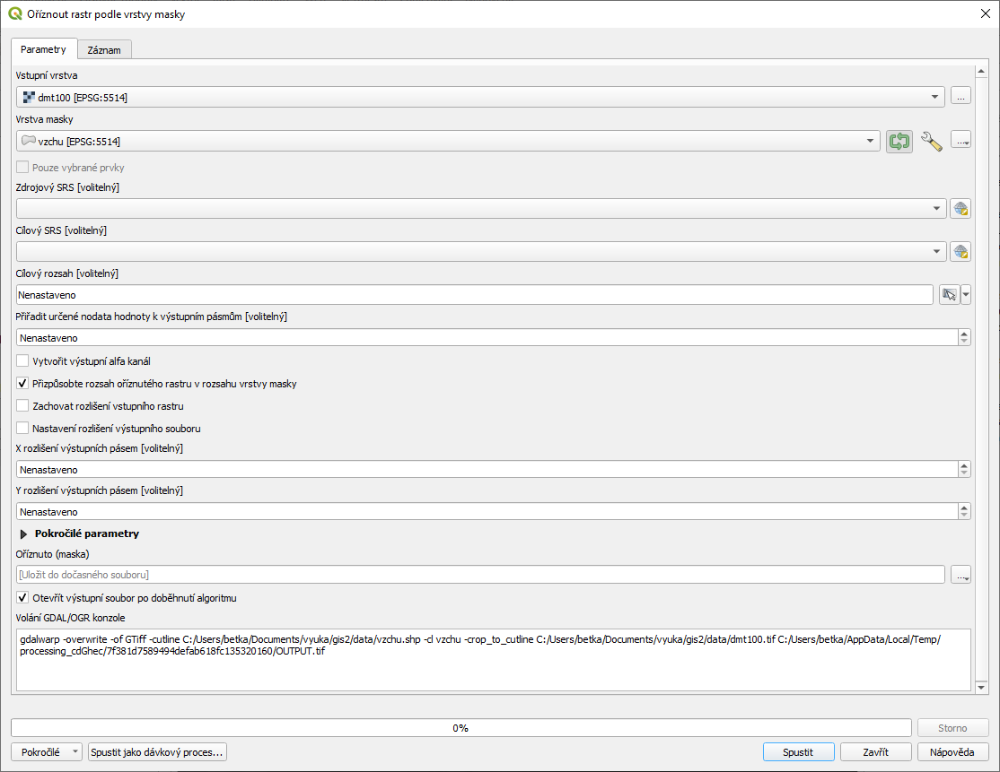

"Otázka"
Jaký postup by bylo nutné zvolit, aby správce každého území dostal ořezaný rastr svého území spolu s ochranným pásmem?

Další možností je používat nástroje v módu "Dávkové zpracování". Otevřeme nástroj "Obalová zóna vektorové vrstvy" ze skupiny GDAL a pomocí tlačítka "Spustit jako dávkový proces..." se otevře nastavení pro nastavení v řádkovém zápisu. Nastavíme veliksot bufferu na 3km, a rozpuštění podle atributu "KAT". 
Přidáme další 2 řádky, které vyplníme pouze s rozdílem velikosti obalové zóny na 6km a 10km.
V posledním sloupečku se nastavuje způsob výstupu. Přes talčítko lze zvolit výstupní soubor, kam zadáme název výstupního GPKG. Náseldně se dialog zeptá na automatickou výplň, kde zvolíme "Vyplnit hodnotami parametru" a vybereme "Vzdálenost obalové zóny". Doporučujeme manuálně upravit na hodnotu bez desetinného místa. 
Nevýhodou je, že nelze jednoduše uložit do jednoho GPKG jako vícero vrstev.
Zaškrtneme "Načíst vrstvy po dokončení".

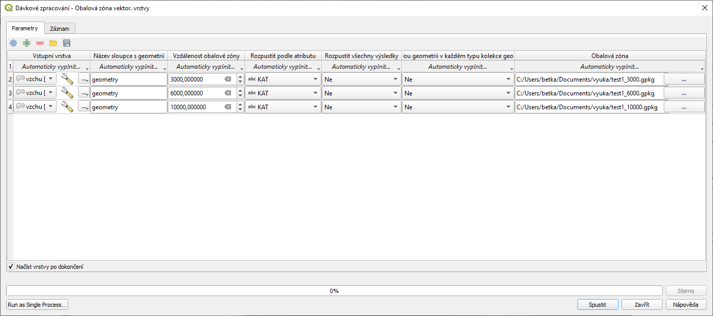

Veškeré nastavení je v processingovém menu možné upravit. Rovněž je k dispozici historie procesů, odkud lze jednotlivý proces opakovaně spustit se všemi parametry.

### Grafický modelář

Podklady:

- [Grafický modelář](https://gismentors.github.io/qgis-pokrocily/modeler/index.html)

V tomto prostředí je možné sestavit řetězec algoritmů, které zpracovávají data a ten pak spouštět jako samostatný proces. Jako ukázku si zkusíme sestavit jednoduchý model.

1. Vytvoříme nový model
2. Nastavíme vlastnosti modelu (název, skupina), model uložíme do souboru.

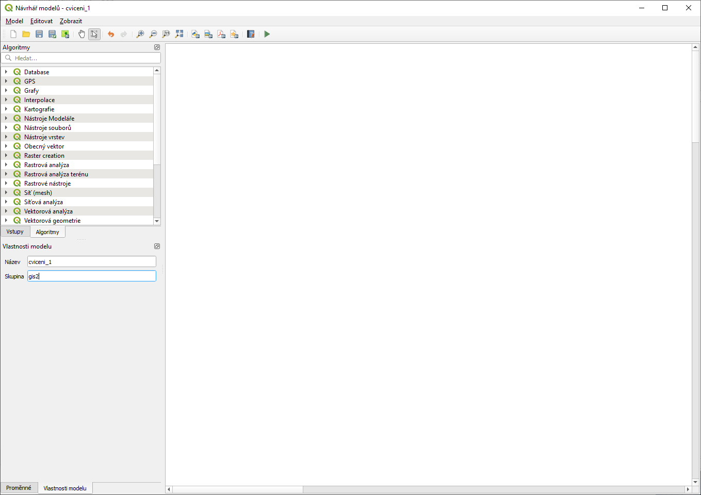

3. Přidáme vstupní parametr typu číslo s popisem "počet bodů", vstup bude celočíselný.

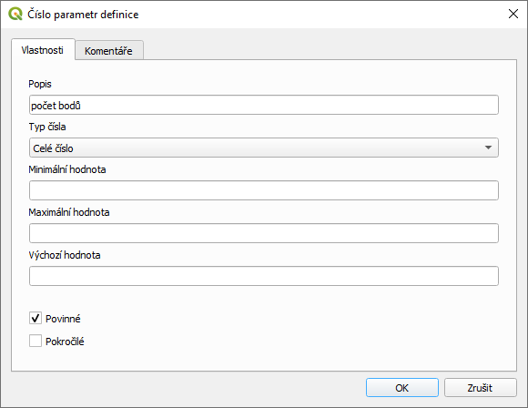

4. Přidáme vstupní parametr typu Rozsah. Díky překladu jsou tam 2 stejné hodnoty, použijeme druhý parametr s popisem "rozsah". Jedná se o parametr typu "Extent".

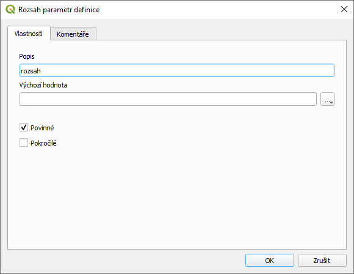

5. Přidáme algoritmy (náhodné body v rozsahu). Počet bodů a rozsah provážeme se vstupními parametry z bodu 3. a 4. Nastavíme výstup pro kontrolu.

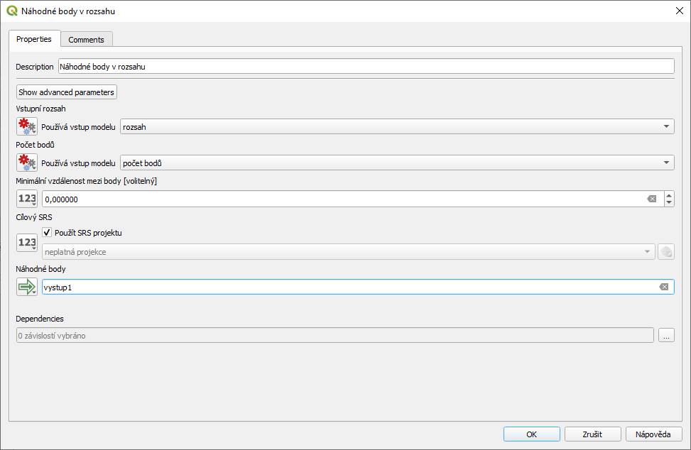

6. Model spustíme a zkontrolujeme zda se výstup generuje dle zadání.

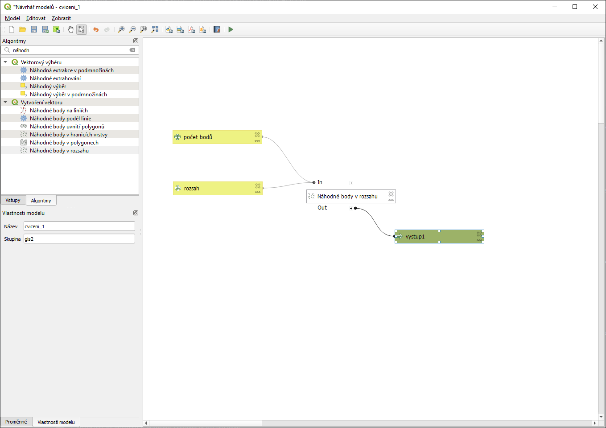
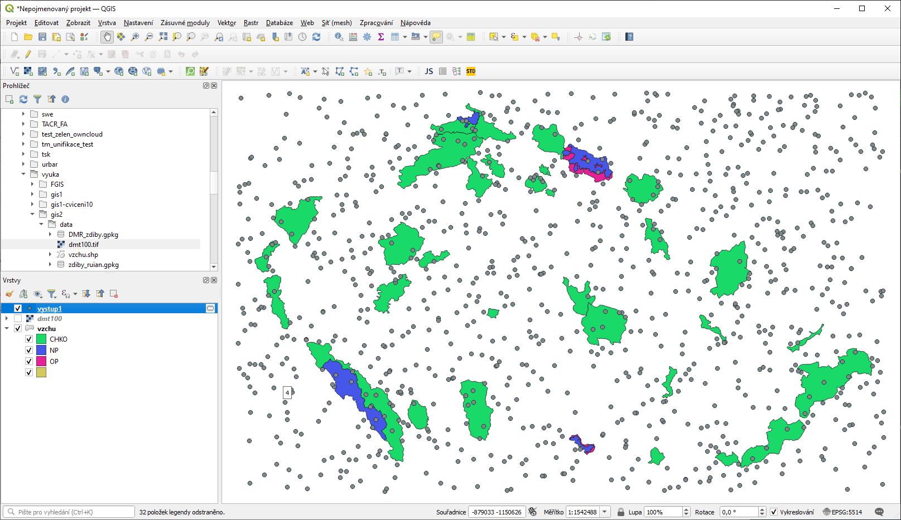

7. Model upravíme - přídáme vstupní parametr typu číslo pro zadání velikosti obalové zóny. Popis nastavíme jako "velikost obalové zóny" a nastavíme číslo jako desetinné. Výchozí hodnotu nastavíme jako 1000 (metrů).

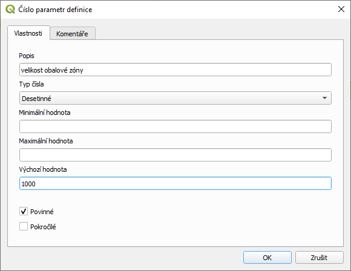

8. Model upravíme - přídáme algoritmus pro obalovou zónu, která vygeneruje obalovou zónu dle zadané velikosti z vygenerovaných bodů.

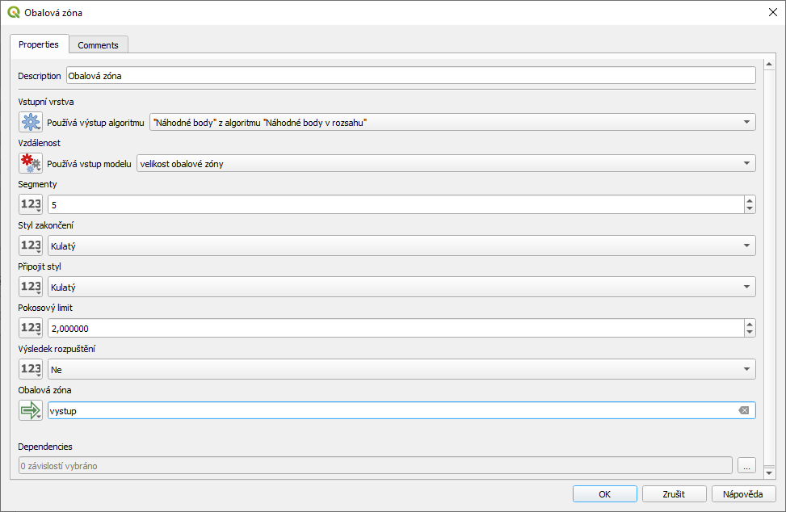

9. Model spustíme
   
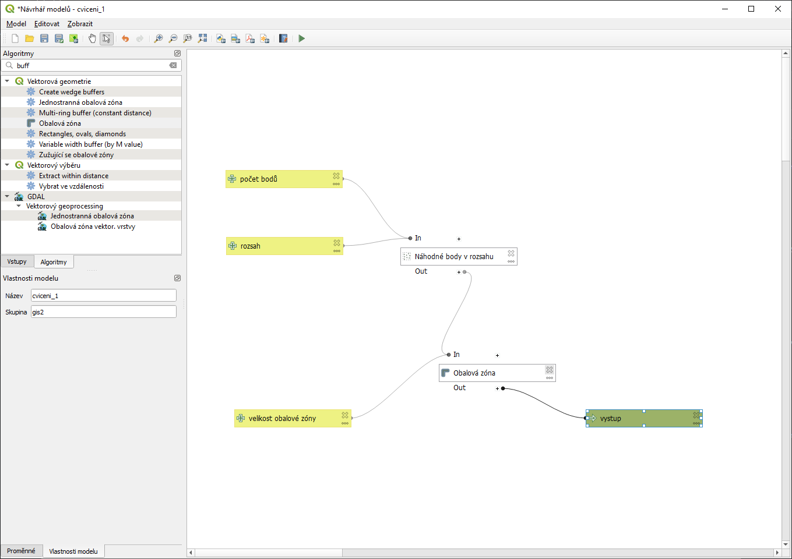

10. Upravíme nápovědu modelu
11. Model exportujeme do skriptu
12. Vyzkoušíme spustít model z panelu nástrojů zpracování

## Simulace výběru pozemků pro výstavbu dle sklonitosti

Zjednodušeně si vyzkoušíme malou část takovéhoto postupu.
Prvním krokem je stažení a práce s daty DMR5G. Druhá je pak interakce výběr parcel podle požadované sklonitosti.

### DMR5G

Podklady:

- [Práce s 3D daty](https://gismentors.github.io/qgis-pokrocily/3d/index.html)
- [Terénní analýzy](https://gismentors.github.io/qgis-zacatecnik/rastrova_data/rastr_terenni_analyzy.html)

Prvním krokem je výpočet výškového rastru z dat DMR5G. V nástrojích zpracování vyhledáme nástroj "TIN interpolace". Jedinou vstupní vrstvou jsou body z DMR5G, u kterých používáme jejich Z souřadnici. 
Požadovaným výstupem bude rastr s velikostí pixelu 2x2m v rozsahu totožném jako je vstupní vrstva. 

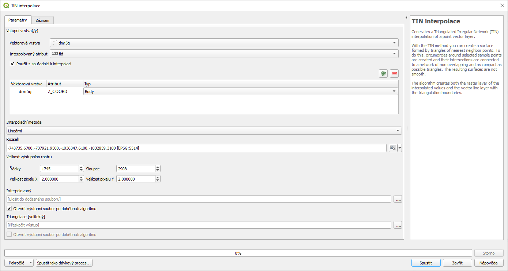

Následuje pak výpočet sklonitosti, který najdeme v menu "Rastr"->"Analýza"->"Sklon...". Vstupní vrstva je výstupní výškový rastr z předešlého korku. Další dodatečné nastavení v tomto případě nejsou zapotřebí.

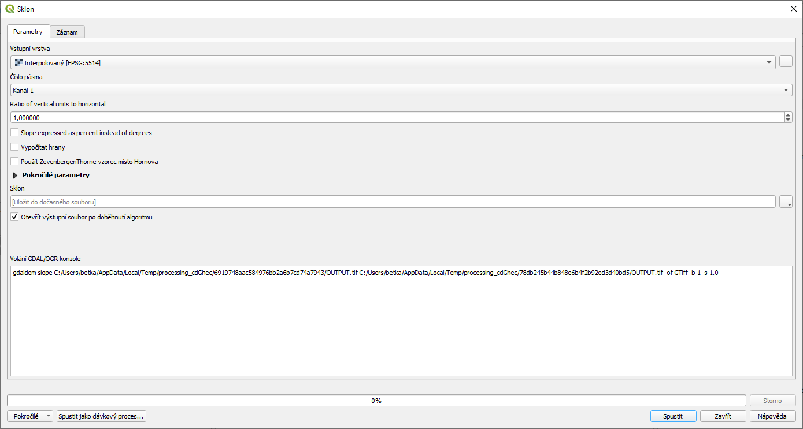

Pro další práci nás zajímají pouze plochy s sklonem menším než 2°. Použijeme nástroj "Reklasifikovat podle tabulky". V pravidlech nastavím reklasifikační hodnotu pro interval 0-2° ->1 a hodnoty mimo rozsah  budou zařazena jako NO_DATA. Výstupné vrstvě změníme symbologii na "Paleta/jedinečné hodnoty" pro mořnost vizuální kontroly výstupu.

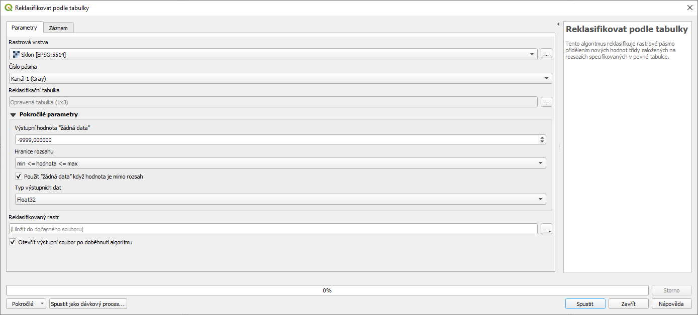

V dalším kroku je výhodné převéz vybrané plochy na polygonovou vrstvu. Použijeme nástroj "Převézt na polygony (rastr na vektor)".

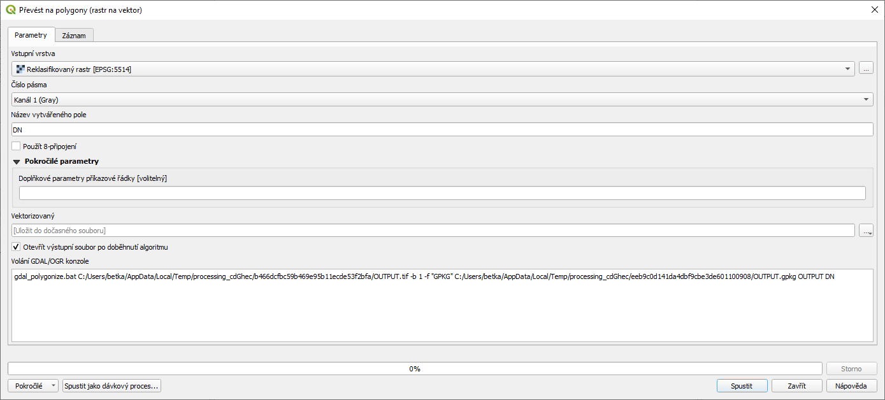

Plochy, které jsou menší než 40 000 m2 nejsou pro vybraný účel výstavby vhodné, proto potřebujeme vybrat pouze parcely s plovhou větší než uvedená mezní hodnota. Toto nám umožní atributový dotaz s podmínkou "$area  >=  40000". Vybrané parcely uložíme do samostatné vrstvy.

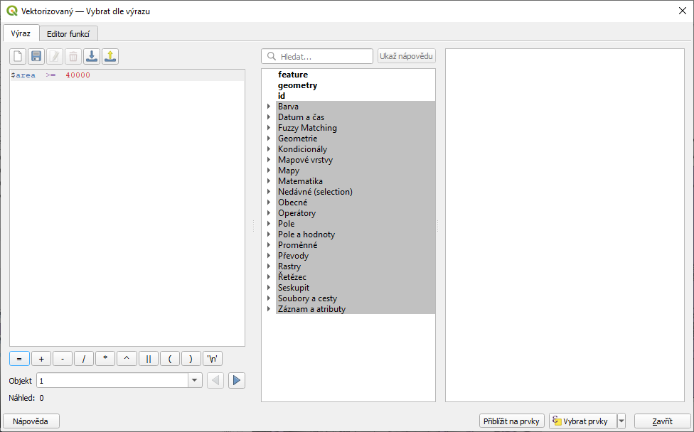

Pro výběr parcel je vhodné použít data z RÚIANu - stažení dat dle cvičení [GIS1](https://k155cvut.github.io/gis-1/cviceni/cviceni9/).

Následně potřebujeme ořezat parcely plochami s vhodnou svažitostí. Pro tento krok použijeme funkci "CLIP".

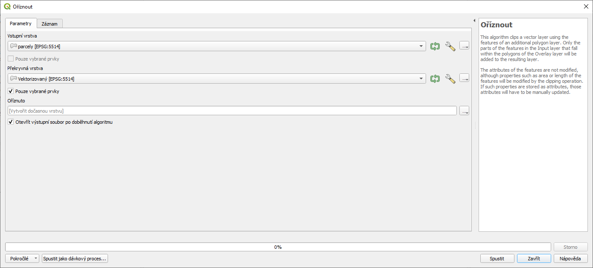
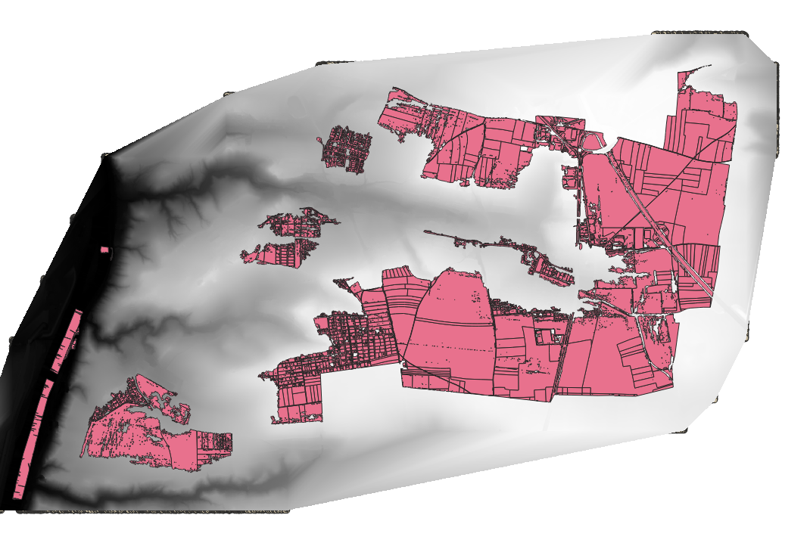

## Zadání domácího úkolu k semestrální práci

Vytvořte model pro poslední část cvičení (Výběr parcel dle sklonitosti).
